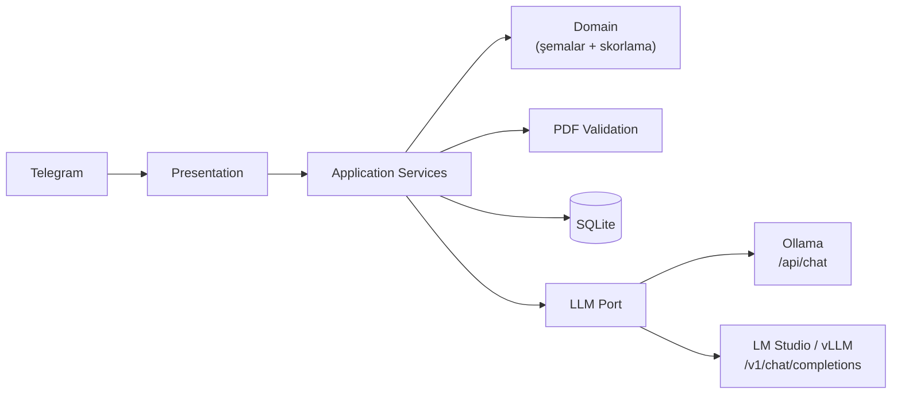

# Yapay Zeka Destekli Telegram İK ve Sohbet Botu

[](https://github.com/semihbugrasezer/sisoft-project/actions/workflows/ci.yml)


PDF'deki proje tanımını iki eşit önemli akışla karşılayan asenkron bir Telegram
botu:

1. **Daily Chat:** Günlük konuşmalarda bağlamı backend'de korur ve yeni mesajlara
   geçmişi dikkate alarak yanıt verir.
2. **Dinamik İK analizi:** Kullanıcının doğal dille tanımladığı kriterlere göre
   farklı şablonlardaki CV'leri doğrular, ortak bir `CandidateProfile` JSON
   şemasına normalize eder ve tekli ya da çoklu analiz üretir.

Her iki akış da aynı katmanlı mimariyi ve `LLMPort` sözleşmesini kullanır. Sistem
yerel veya uzak bir LLM ucuyla çalışabilir; varsayılan ve canlı kabul referansı
**Ollama + `qwen2.5:7b`**'dir. **LM Studio** protokol entegrasyonu canlı
doğrulanmıştır; bu makinedeki `google/gemma-4-e4b` modeli güncel kabul koşusunda
tüm kalite kapılarını tutarlı geçememiştir. **vLLM** aynı OpenAI-uyumlu adaptörle
desteklenir ancak bu donanımda canlı çalıştırılmamıştır. Çıkarım kalitesi modele
bağlıdır; ölçümler ve kanıt sınırları [Canlı Doğrulama](docs/VALIDATION.md)
belgesindedir.

## Demo

Gerçek Telegram üzerinden, gerçek yerel Ollama sunucusuna karşı çalıştırılan
5 CV'lik toplu analiz — top-3 JSON çıktısı, ödev PDF §4 şemasıyla birebir:


## Mülakat Değerlendirme Haritası

| PDF değerlendirme kriteri | Projedeki karşılığı | Doğrulanabilir kanıt |
|---|---|---|
| **Dinamik Prompt Başarısı** | Serbest metin önce kriter niyeti olarak sınıflandırılır, ardından özel prompt ile tüm kriterler çıkarılır. Aynı kriterler tekli Markdown raporunda ve çoklu top-3 JSON akışında kullanılır. | [`criteria_service.py`](app/application/criteria_service.py), [`prompts.py`](app/infrastructure/llm/prompts.py), [LLM Hattı](docs/LLM_PIPELINE.md) |
| **PDF Doğrulama & LLM Extraction Kalitesi** | Bozuk, şifreli ve metinsiz PDF'ler LLM çağrısından önce reddedilir. Geçerli metin önce `CandidateProfile` şemasına normalize edilir; ham PDF doğrudan skorlanmaz. Kaynakta bulunmayan ad, beceri ve skor kanıtı deterministik olarak filtrelenir. | [`pymupdf_parser.py`](app/infrastructure/pdf/pymupdf_parser.py), [`models.py`](app/domain/models.py), [`grounding.py`](app/domain/grounding.py), [Gereksinim Matrisi](docs/REQUIREMENTS_TRACEABILITY.md) |
| **Asenkron Süreç & Bağlam Yönetimi** | Telegram update'leri eşzamanlı kabul edilir; bloklayan PDF/SQLite işleri thread'e taşınır. Sohbet sırası `chat_id` bazlı kilitle, uzun dönem bağlam sıcak pencere + rolling summary ile korunur. Batch analizi sohbet akışını kilitlemez. | [`router.py`](app/presentation/telegram/router.py), [`chat_service.py`](app/application/chat_service.py), [Eşzamanlılık](docs/CONCURRENCY.md) |
| **Vibe Coding Hakimiyeti** | AI araçlarının rolü, insan denetim kapıları, reddedilen öneriler, gerçek hatalar ve mimari trade-off'lar açıkça kaydedilmiştir. Kod hâkimiyeti otomatik testler ve gerçek model koşularıyla gösterilir. | [AI Destekli Geliştirme](docs/AI_ASSISTED_DEVELOPMENT.md), [Tasarım Kararları](docs/DESIGN_DECISIONS.md), [Test Stratejisi](docs/TESTING.md), [Canlı Doğrulama](docs/VALIDATION.md) |

PDF'deki tüm fonksiyonel ve teknik maddelerin kod/test karşılığı için tek kaynak:
**[Gereksinim İzlenebilirlik Matrisi](docs/REQUIREMENTS_TRACEABILITY.md)**.

## Mimari



İşlem hattı:

```
PDF → Doğrulama → Metin çıkarma → LLM Extraction → CandidateProfile JSON
                                                        ↓
                                                  Değerlendirme
                                                  ↙          ↘
                                        Markdown rapor    Backend'de
                                           (tekli)      ortalama + top-3
```

Aritmetik ortalama ve sıralama LLM'e değil backend'e aittir
(`app/domain/scoring.py`). Katman sorumlulukları, bağımlılık yönü ve hata
yayılımı: **[docs/ARCHITECTURE.md](docs/ARCHITECTURE.md)**.

## Proje Yapısı

```text
.
├── app/
│   ├── domain/                  Şemalar, hatalar, LLM portu, grounding ve skorlama
│   ├── application/             Sohbet, kriter ve CV use-case'leri
│   ├── infrastructure/          LLM, PDF ve SQLite adaptörleri
│   ├── presentation/telegram/   Handler, router, formatter ve albüm toplama
│   ├── config.py                Ortam yapılandırması
│   └── container.py             Composition root / bağımlılık kurulumu
├── docs/                        Mimari, izlenebilirlik ve doğrulama kanıtları
├── mock_cvs/                    Beş farklı şablon ve geçersiz PDF örnekleri
├── scripts/                     Fixture üretimi ve gerçek-model kabul testi
├── tests/                       Birim ve entegrasyon testleri
├── .github/workflows/ci.yml     Python 3.13/3.14 kalite kapısı
├── main.py                      Long-polling giriş noktası
└── pyproject.toml               Paket metadatası ve araç yapılandırması
```

Bu yapı katman sorumluluklarını ayırır; yalnız gerçekten birden fazla
implementasyonu bulunan LLM erişimi port/adapter ile soyutlanır. Ayrıntılı dosya
haritası ve gerçek bağımlılık yönü [Mimari](docs/ARCHITECTURE.md) belgesindedir.

## Önkoşullar

- Python 3.13 veya 3.14
- BotFather'dan alınmış bir Telegram bot token'ı
- Yerel LLM sunucusu: varsayılan akış için [Ollama](https://ollama.com/download),
  alternatif olarak LM Studio veya vLLM

## Kurulum

```bash
git clone https://github.com/semihbugrasezer/sisoft-project.git
cd sisoft-project
python3 -m venv .venv && source .venv/bin/activate
pip install -r requirements.txt
cp .env.example .env          # TELEGRAM_BOT_TOKEN ekleyin (BotFather'dan)
ollama pull qwen2.5:7b        # ilk kurulumda bir kere
python main.py                # Ollama ayakta olmalı (ollama serve)
```

Başlıca ayarlar (tamamı `.env.example` içinde açıklamalarıyla birlikte):

| Değişken | Varsayılan | Açıklama |
|---|---|---|
| `TELEGRAM_BOT_TOKEN` | — | BotFather token'ı (zorunlu) |
| `LLM_BACKEND` | `ollama` | `ollama` veya `openai_compatible` (LM Studio / vLLM) |
| `LLM_BASE_URL` | `http://localhost:11434` | LLM sunucu adresi |
| `LLM_MODEL` | `qwen2.5:7b` | Kullanılacak model |
| `CHAT_RETENTION_HOURS` | `168` | Sohbet mesajları ve rolling summary için açılış temizliği yaş eşiği |
| `CV_RETENTION_HOURS` | `24` | Açılış temizliğinde kullanılan yaş eşiği: bu yaştan eski, analiz edilmemiş CV'ler silinir |

LM Studio'ya geçmek için yalnızca üç satır değişir (`LLM_BACKEND=openai_compatible`,
`LLM_BASE_URL=http://localhost:1234`, `LLM_MODEL=google/gemma-4-e4b`); kod
değişmez, application servisleri hangi motorun çalıştığını bilmez.

## Kullanım

1. `/start` — komutları listeler.
2. Kriterleri serbest metinle tanımla:
   *"CV'leri React tecrübesi, temiz kod ve uzaktan çalışma uyumuna göre değerlendir."*
3. Tek CV gönder → detaylı Markdown analiz raporu.
4. 2-5 CV'yi albüm olarak birlikte gönder → otomatik top-3 JSON.
   (Tek tek göndermek için `/batch` → PDF'ler → `/analyze`.)
5. `/criteria_show`, `/cancel`, `/reset` — yardımcı komutlar.

Çoklu CV çıktısı ödev PDF §4 şemasıyla birebirdir (`status`,
`processedCVCount`, `userDefinedCriteria`, `topCandidates[]`) ve
`extra="forbid"` ile kilitlidir.

## Test

```bash
pip install -r requirements-dev.txt
python -m pytest tests/ -q
ruff check app main.py tests scripts
mypy app main.py
```

Birim/entegrasyon testleri taklit LLM ile çalışır. Ödevin **birebir senaryosunu
gerçek modele karşı** çalıştıran ayrı bir kabul testi de vardır — kriterlerin
eksiksiz çıkarıldığını ve top-3 JSON sözleşmesini (ortalamaları bağımsız yeniden
hesaplayarak) doğrular:

```bash
python scripts/validate_assignment.py           # kriterler + tekli CV
python scripts/validate_assignment.py --full    # + 5 CV batch, top-3
```

Ayrıntı:
**[docs/TESTING.md](docs/TESTING.md)** ve **[docs/VALIDATION.md](docs/VALIDATION.md)**.

## Tasarım Kararları

- **Ham PDF skorlanmaz** — önce ortak JSON şemasına normalize edilir; tüm
  puanlama bu şema üzerinden yürür (ödevin çekirdek şartı).
- **Ortalama LLM'e yaptırılmaz** — aritmetik ve sıralama backend'de
  deterministik hesaplanır.
- **Şema geçerliliği ≠ anlamsal geçerlilik** — yüksek skor kanıtındaki somut
  iddialar hem normalize profilde hem ham kaynakta bulunmalı; kriter kimlikleri
  tanımlı kümeyle birebir eşleşmelidir.
- **Batch'te toplu LLM isteği** — tek yerel modeli N eşzamanlı istekle boğmak
  yerine iki toplu çağrı; PDF doğrulama yine paraleldir.
- **Pragmatik katmanlı mimari** — yalnızca LLM erişimi port/adapter ile
  soyutlanmıştır; tek implementasyonu olan bağımlılıklara arayüz eklenmemiştir.

Gerekçeler ve değerlendirilip reddedilen alternatifler:
**[docs/DESIGN_DECISIONS.md](docs/DESIGN_DECISIONS.md)**.

## Bilinen Sınırlamalar

- **Yerel model gecikmesi** — 5 CV'lik batch bu donanımda ~8–17 dakika sürer;
  darboğaz model/donanım, mimari değil.
- **OCR yok** — taranmış/görsel-yalnızca PDF'ler net bir hatayla reddedilir.
- **Metin sınırı** — çok uzun CV'ler kırpılır; kullanıcı uyarılır.
- **Demo kapsamı** — encryption-at-rest yoktur ve depolama tek instance
  varsayar; gerçek İK verisiyle üretimde kullanmadan önce [SECURITY.md](SECURITY.md).

## Dokümantasyon

| Doküman | Tek sorumluluğu |
|---|---|
| [Gereksinim İzlenebilirliği](docs/REQUIREMENTS_TRACEABILITY.md) | PDF maddesi → kod → test/canlı kanıt eşlemesi |
| [Mimari](docs/ARCHITECTURE.md) | Katmanlar, bağımlılık yönü ve hata yayılımı |
| [LLM Hattı](docs/LLM_PIPELINE.md) | Prompt, structured output, grounding ve prompt-injection savunması |
| [Eşzamanlılık](docs/CONCURRENCY.md) | Update, kilit, thread ve batch çalışma modeli |
| [Test Stratejisi](docs/TESTING.md) | Otomatik test kapsamı ve gerçek-model kabul komutları |
| [Canlı Doğrulama](docs/VALIDATION.md) | Tarihli gerçek Ollama/LM Studio/Telegram sonuçları ve sınırlamalar |
| [Tasarım Kararları](docs/DESIGN_DECISIONS.md) | Seçilen ve reddedilen alternatiflerin gerekçeleri |
| [AI Destekli Geliştirme](docs/AI_ASSISTED_DEVELOPMENT.md) | AI araçları, insan denetimi ve yakalanan gerçek hatalar |
| [Güvenlik](SECURITY.md) | Tehdit modeli, veri yaşam döngüsü ve üretim sınırları |
| [Katkı Rehberi](CONTRIBUTING.md) | Geliştirme, kalite kapıları ve PR politikası |
