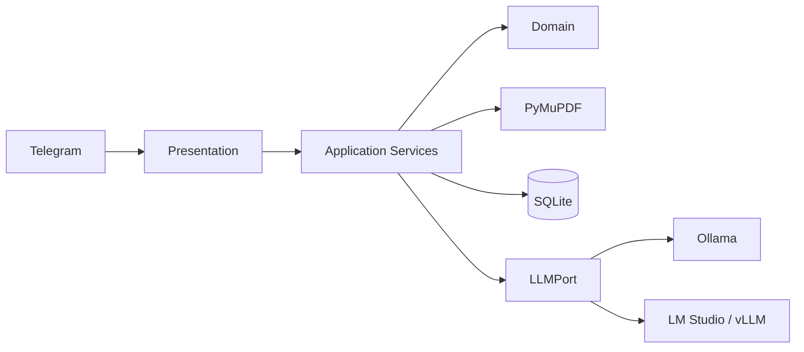

# Yapay Zeka Destekli Telegram İK ve Sohbet Botu

[](https://github.com/semihbugrasezer/sisoft-project/actions/workflows/ci.yml)


Bağlamı koruyan günlük sohbet ile serbest metinden tanımlanan kriterlere göre CV
analizini tek bir asenkron Telegram botunda birleştirir. PDF'ler önce doğrulanır,
ardından ortak `CandidateProfile` JSON şemasına çıkarılır; tekli analiz Markdown,
2–5 CV'lik toplu analiz ise Top-3 JSON üretir.

## Özellikler

- SQLite geçmişi ve rolling summary ile bağlamlı günlük sohbet
- Komut zorunluluğu olmadan serbest metinden dinamik değerlendirme kriterleri
- Bozuk, şifreli, sayfasız ve metinsiz PDF'leri LLM'den önce reddetme
- Tüm CV alanlarını kaynak metne dayandıran structured extraction
- Güçlü/zayıf yönler ve gelişim tavsiyeleri içeren tekli Markdown raporu
- En fazla 5 CV için backend'de deterministik ortalama ve Top-3 JSON
- Telegram update'lerini bloklamayan async I/O ve paralel PDF doğrulama
- Ollama ile native; LM Studio ve vLLM ile OpenAI-uyumlu LLM adaptörü

PDF'deki her gereksinimin kod ve test karşılığı
[izlenebilirlik matrisinde](docs/REQUIREMENTS_TRACEABILITY.md) bulunur.

## Mimari



Ham PDF evaluator'a verilmez. Puanlama normalize profil üzerinden yürür;
kanıt grounding'i, ortalama ve sıralama backend'de deterministik uygulanır.
Katmanlar, async çalışma modeli ve karar gerekçeleri için
[Mimari](docs/ARCHITECTURE.md) belgesine bakın.

## Proje Yapısı

```text
app/
├── domain/                 Şemalar, hatalar, LLM portu ve skorlama
├── application/            Sohbet, kriter ve CV use-case'leri
├── infrastructure/         LLM, PDF ve SQLite adaptörleri
└── presentation/telegram/  Router, handler ve formatter
docs/                       Mimari, LLM hattı ve doğrulama kanıtları
mock_cvs/                   Beş farklı CV şablonu ve geçersiz örnekler
scripts/                    Fixture üretimi ve canlı kabul testi
tests/                      Birim ve entegrasyon testleri
main.py                     Long-polling giriş noktası
```

## Kurulum

Önkoşullar: Python 3.13 veya 3.14, BotFather token'ı ve çalışan bir LLM sunucusu.

```bash
git clone https://github.com/semihbugrasezer/sisoft-project.git
cd sisoft-project
python3 -m venv .venv
source .venv/bin/activate
pip install -r requirements.txt
cp .env.example .env
ollama pull qwen2.5:7b
python main.py
```

`.env` içinde `TELEGRAM_BOT_TOKEN` değerini tanımlayın. Varsayılan backend
`Ollama + qwen2.5:7b`'dir. LM Studio için:

```dotenv
LLM_BACKEND=openai_compatible
LLM_BASE_URL=http://localhost:1234
LLM_MODEL=google/gemma-4-e4b
```

vLLM aynı `/v1/chat/completions` adaptörünü kullanır. LM Studio gerçek kriter,
tekli CV ve 5-CV akışlarıyla doğrulanmıştır; vLLM bu Apple Silicon ortamında
canlı çalıştırılmamıştır. Tüm ayarlar açıklamalarıyla [.env.example](.env.example)
içindedir.

## Kullanım

1. Bota kriterleri doğal dille yazın:  
   `React tecrübesi, temiz kod ve uzaktan çalışma uyumuna göre değerlendir.`
2. Tek PDF gönderin; bot ayrıntılı Markdown raporu döndürür.
3. 2–5 PDF'yi albüm olarak gönderin; bot Top-3 JSON döndürür.
4. Tek tek yükleme için `/batch`, PDF'ler ve ardından `/analyze` kullanın.
5. `/criteria_show`, `/cancel` ve `/reset` yardımcı komutlardır.

## Doğrulama

```bash
pip install -r requirements-dev.txt
python -m pytest -q
ruff check app main.py tests scripts
mypy app main.py
```

Gerçek LLM kabul testi PDF'deki kriter, tekli rapor ve Top-3 senaryosunu çalıştırır:

```bash
python scripts/validate_assignment.py
python scripts/validate_assignment.py --full
```

CI bu kapıları Python 3.13 ve 3.14 için çalıştırır. Tarihli Ollama, LM Studio ve
Telegram sonuçları [Canlı Doğrulama](docs/VALIDATION.md) belgesindedir.

## Demo

Gerçek Telegram + Ollama ile üretilen 5-CV Top-3 çıktısı:

<p>
  
  
</p>

## Dokümantasyon

- [Mimari](docs/ARCHITECTURE.md) — katmanlar, async model ve tasarım kararları
- [LLM Hattı](docs/LLM_PIPELINE.md) — prompt rolleri, şemalar ve grounding
- [Gereksinim İzlenebilirliği](docs/REQUIREMENTS_TRACEABILITY.md) — PDF → kod → test
- [Canlı Doğrulama](docs/VALIDATION.md) — otomatik ve gerçek-model kanıtları
- [AI Destekli Geliştirme](docs/AI_ASSISTED_DEVELOPMENT.md) — araç kullanımı ve insan denetimi
- [Güvenlik](SECURITY.md) — veri yaşam döngüsü ve üretim sınırları

## Sınırlamalar

- Görsel-tabanlı PDF'ler için OCR yoktur; okunabilir metin bulunmazsa belge reddedilir.
- Yerel model hızı donanıma bağlıdır; bu makinede 5-CV koşuları yaklaşık 8–27 dakika sürer.
- Çok uzun CV metni context güvenliği için kırpılır ve kullanıcı bilgilendirilir.
- Demo SQLite verisini şifrelemez; gerçek İK verisiyle üretim kullanımı için
  [SECURITY.md](SECURITY.md) içindeki sertleştirmeler gerekir.
