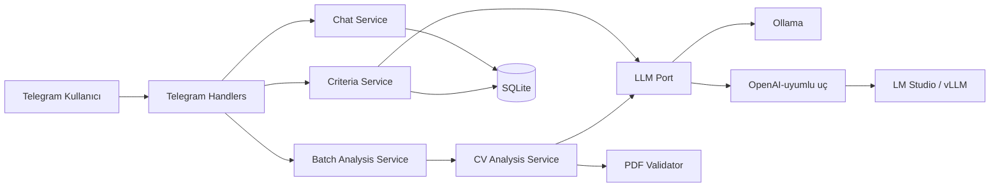
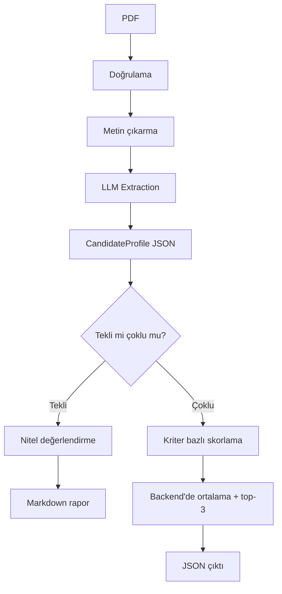

# Yapay Zeka Destekli Dinamik Telegram İK ve Sohbet Botu

[](https://github.com/semihbugrasezer/sisoft-project/actions/workflows/ci.yml)
Python · python-telegram-bot · Ollama / LM Studio / vLLM · Pydantic · PyMuPDF · SQLite

Kullanıcılarla günlük konularda bağlamı koruyarak sohbet eden, aynı zamanda
konuşma içinde tanımlanan **dinamik kriterlere** göre yüklenen CV'leri analiz
eden bir Telegram botu. Backend Python ile yazılmıştır; katmanlı bir mimariye
(`domain / application / infrastructure / presentation`) sahiptir ve arka
planda **Ollama**, **LM Studio** veya **vLLM**'den herhangi biriyle çalışabilir.

## Özellikler

- **Genel sohbet** — bağlamı (chat history) koruyan, backend'de güvenli
  şekilde yönetilen sohbet akışı.
- **Dinamik kriter tanımlama** — sabit bir kriter listesi yok; kullanıcı
  puanlama kriterlerini serbest metinle tanımlar ("React tecrübesi ve temiz
  kod yazımına göre skorla").
- **Tekli CV analizi** — tek bir CV yüklendiğinde, tanımlı kriterlere göre
  güçlü/zayıf yönler ve gelişim tavsiyeleri içeren okunaklı bir Markdown
  rapor üretir.
- **PDF doğrulama** — bozuk, şifreli, okunamaz veya geçersiz PDF'leri
  backend'de yakalar, kullanıcıya net bir hata mesajıyla döner.
- **LLM Extraction** — ham PDF metni doğrudan skorlanmaz; önce ortak bir
  JSON şemasına (yetenekler, iş deneyimi, eğitim, diller) çevrilir. Tüm
  puanlama ve analiz bu şema üzerinden yürür.
- **Çoklu CV skorlama** — en fazla 5 CV kabul edilir. PDF doğrulama ve metin
  çıkarma `asyncio.gather` ile paralel çalışır; LLM extraction ve
  değerlendirme, tek yerel model sunucusunu N ayrı istekle boğmamak için
  belge başına değil, tüm belgeler için tek bir toplu (batched) yapılandırılmış
  istek olarak yürütülür. Ortalama backend'de deterministik hesaplanır, en
  yüksek 3 aday yapılandırılmış bir JSON çıktısı olarak döner.
- **Kilitlenmeyen asenkron altyapı** — Telegram Long Polling üzerinden
  çalışır; çoklu CV işlenirken bot diğer sohbetlere yanıt vermeye devam eder.

## Ödev Gereksinim Karşılama

| Gereksinim | Karşılık |
|---|---|
| Genel sohbet, bağlam korunması | `ChatService` + SQLite (sıcak pencere + rolling summary) |
| Serbest metinden dinamik kriter | `CriteriaService`, yapılandırılmış LLM çıktısı |
| Tekli CV detaylı analiz (strengths/weaknesses/recommendations) | `CVAnalysisService` → `EvaluationResult` → Markdown rapor |
| PDF doğrulama (bozuk/şifreli/okunamaz) | `pymupdf_parser.py`, sırayla doğrulanan 6 senaryo (boş/imza/açılamayan/şifreli/sayfasız/metinsiz), tek `PDFValidationError` |
| LLM Extraction → ortak JSON şeması | `CandidateProfile` (`extra="forbid"`) |
| Skorlama/filtreleme yalnızca ortak JSON üzerinden | evaluator prompt'u yalnızca `profile.model_dump_json()` alır |
| En fazla 5 CV, asenkron/paralel işleme | `MAX_CV_COUNT=5`, PDF validation `asyncio.gather` ile paralel |
| Top-3 JSON (beklenen şema) | `MultiAnalysisResponse`, ödev PDF §4 ile birebir |
| Telegram, kilitlenmeyen asenkron mesajlaşma | `python-telegram-bot`, `concurrent_updates(8)` |
| Ollama / vLLM / LM Studio entegrasyonu | `LLMPort` arayüzü, `LLM_BACKEND` ile seçilir |
| Katmanlı mimari | `domain / application / infrastructure / presentation` |

## Mimari

```
presentation/telegram/  → Telegram I/O: komutlar, mesaj işleme, formatlama
application/             → use-case servisleri: sohbet, kriter, CV analizi, batch
domain/                  → Pydantic şemaları ve saf iş mantığı (skorlama)
infrastructure/          → LLM istemcileri (Ollama/OpenAI-uyumlu), PDF parser, SQLite
```

Bağımlılıklar tek yönde akar: `presentation → application → domain`;
`infrastructure` bu ikisinin arayüzlerini uygular. `container.py`
bağımlılıkları tek yerde kurar (framework yok, basit constructor injection).



CV analiz hattı (tekli ve çoklu ortak): ham PDF **hiçbir zaman** doğrudan
skorlanmaz, önce ortak şemaya çevrilir.



## Teknoloji

- **Python**, `python-telegram-bot` (async, Long Polling)
- **Ollama** (varsayılan) veya **OpenAI-uyumlu** `/v1/chat/completions` ucu
  üzerinden LM Studio / vLLM — `LLM_BACKEND` ile seçilir
- **PyMuPDF** — PDF doğrulama ve metin çıkarma
- **Pydantic** — LLM çıktılarının zorlandığı şemalar
- **SQLite** — sohbet geçmişi ve kriter kalıcılığı

## Kurulum

```bash
python3 -m venv .venv
source .venv/bin/activate
pip install -r requirements.txt

cp .env.example .env
# .env içine TELEGRAM_BOT_TOKEN'ı ekleyin (BotFather'dan alınır)

ollama pull qwen2.5:7b   # ilk kurulumda bir kere
```

Çalıştırmadan önce Ollama'nın ayakta olması gerekir (`ollama serve`).

```bash
python main.py
```

## Yapılandırma

`.env` dosyasındaki başlıca değişkenler:

| Değişken | Açıklama |
|---|---|
| `TELEGRAM_BOT_TOKEN` | BotFather'dan alınan token |
| `LLM_BACKEND` | `ollama` (varsayılan) veya `openai_compatible` |
| `OLLAMA_BASE_URL` | LLM sunucu adresi (Ollama, LM Studio veya vLLM) |
| `OLLAMA_MODEL` | Kullanılacak model adı |
| `OLLAMA_MAX_CONCURRENCY` | Sunucuya aynı anda gidebilecek istek sayısı |

`LLM_BACKEND=openai_compatible` ayarlandığında bot, Ollama'nın kendi
`/api/chat` ucu yerine `/v1/chat/completions` üzerinden LM Studio veya vLLM
ile konuşur — `OLLAMA_BASE_URL`/`OLLAMA_MODEL` değişmez, yalnızca farklı bir
sunucuya işaret eder. Application servisleri hangi backend'in çalıştığını
bilmez; ikisi de aynı `LLMPort` arayüzünü uygular (`app/domain/ports.py`).

## Kullanım

1. `/start` — komutları listeler.
2. Serbest metinle kriter tanımla: *"CV'leri React tecrübesi, temiz kod ve
   uzaktan çalışma uyumuna göre değerlendir."*
3. Tek bir CV gönder → detaylı Markdown analiz raporu.
4. 2-5 CV'yi albüm olarak birlikte gönder → otomatik top-3 JSON çıktısı.
   (Tek tek göndermek için `/batch` → PDF'ler → `/analyze`.)
5. `/criteria_show`, `/cancel`, `/reset` — yardımcı komutlar.

## Çıktı Formatı

**Tekli CV:** kriter bazlı skorlar, güçlü yönler, zayıf yönler, gelişim
tavsiyeleri ve genel değerlendirme içeren Markdown rapor.

**Çoklu CV (top-3):**

```json
{
  "status": "success",
  "processedCVCount": 5,
  "userDefinedCriteria": ["React tecrübesi", "Uzaktan çalışma uyumu", "Clean Code"],
  "topCandidates": [
    {
      "rank": 1,
      "candidateName": "Caner Bulut",
      "pdfFileName": "cv_caner_bulut.pdf",
      "dynamicScores": {"React tecrübesi": 95, "Uzaktan çalışma uyumu": 85, "Clean Code": 90},
      "averageScore": 90.0,
      "hrEvaluation": "Aday, tanımlanan dinamik kriterlerin tamamına üst düzey uyum sağlamaktadır."
    }
  ]
}
```

## Test

```bash
python -m pytest tests/ -v
```

Ortalama hesaplama, top-3 sıralama, PDF doğrulama, kriter çıkarımı, sohbet
bağlamı ve Telegram handler'ları için 78 birim/entegrasyon testi içerir.
Ayrıca gerçek yerel model sunuculara (Ollama, LM Studio) karşı canlı testlerle
doğrulandı — bkz. [docs/VALIDATION.md](docs/VALIDATION.md).

Test verisi üretimi:

```bash
python scripts/generate_mock_cvs.py      # mock_cvs/ altına 5 geçerli örnek CV
python scripts/generate_invalid_cvs.py   # mock_cvs/invalid/ altına 4 geçersiz PDF
                                          # (bozuk, şifreli, taranmış, PDF olmayan)
```

## Bilinen Sınırlamalar

- **Yerel 7B model gecikmesi** — 5 CV'lik batch analizi bu donanımda
  ~8-10 dakika sürer; darboğaz model/donanımdır, mimari değil.
- **OCR yok** — taranmış/görsel-yalnızca PDF'ler reddedilir, OCR ile işlenmez.
- **Batch'te CV başına paralel LLM isteği yok** — PDF validation paraleldir,
  LLM extraction/evaluation tüm belgeler için tek bir toplu istektir (bilinçli
  tercih, bkz. [docs/DESIGN_DECISIONS.md](docs/DESIGN_DECISIONS.md)).
- **20.000 karakter extraction sınırı** — çok uzun CV'ler bu sınıra kırpılır;
  kullanıcı Telegram'da bir uyarı mesajıyla bilgilendirilir.

## Detaylı Dokümantasyon

- [docs/ARCHITECTURE.md](docs/ARCHITECTURE.md) — dosya haritası, istek akışı, eşzamanlılık
- [docs/DESIGN_DECISIONS.md](docs/DESIGN_DECISIONS.md) — mimari kararlar ve gerekçeleri
- [docs/VALIDATION.md](docs/VALIDATION.md) — gerçek model sunucularına karşı canlı doğrulama sonuçları
