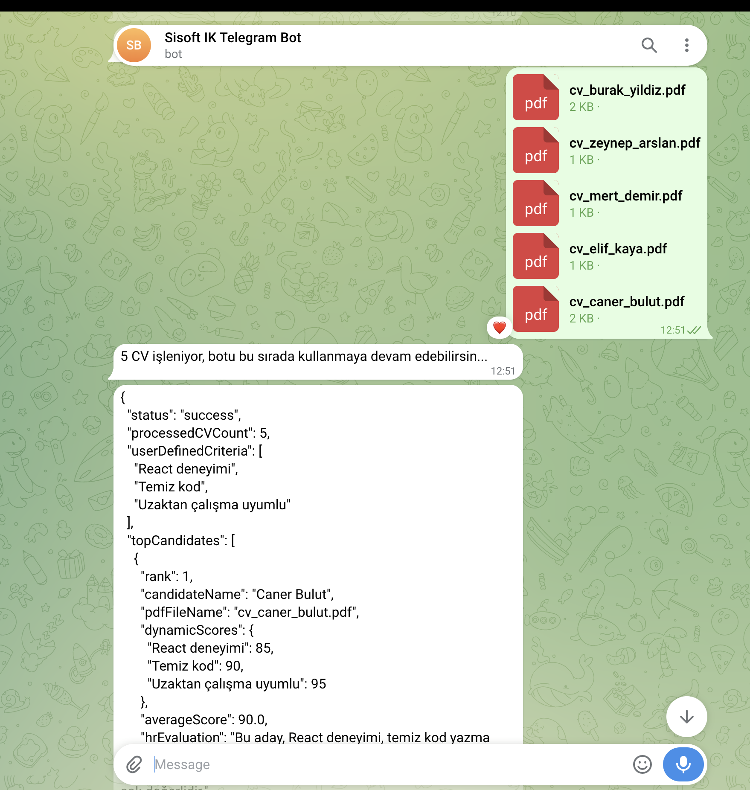
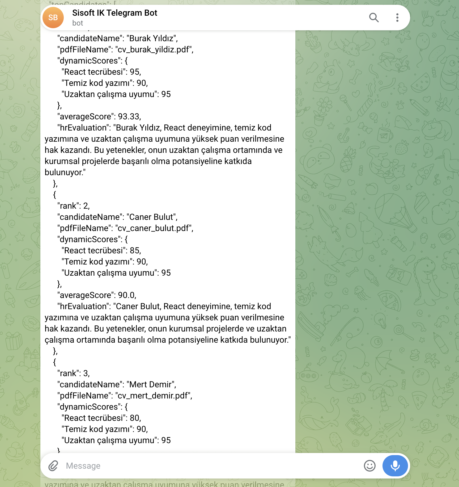
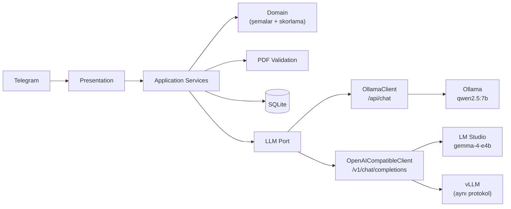

# Yapay Zeka Destekli Telegram İK ve Sohbet Botu

[](https://github.com/semihbugrasezer/sisoft-project/actions/workflows/ci.yml)


Bağlamı koruyan günlük sohbet ile LLM destekli CV değerlendirmesini tek
Telegram arayüzünde birleştiren asenkron bir bot.

Kullanıcı değerlendirme kriterlerini doğal dille tanımlar. Yüklenen CV'ler
doğrulanır, ortak bir `CandidateProfile` şemasına normalize edilir ve
yalnızca bu kullanıcı tanımlı kriterlere göre değerlendirilir — **ham PDF
hiçbir zaman doğrudan skorlanmaz.**

Varsayılan yapılandırma **yerel-öncelikli**: kutudan çıktığı hâliyle
`localhost`'taki Ollama'ya bağlanır, bulut servisi ya da API anahtarı
gerektirmez. Canlı olarak **Ollama** (`qwen2.5:7b`) ve **LM Studio**
(`google/gemma-4-e4b`) ile doğrulanmıştır; **vLLM** aynı protokolü
kullanır (canlı test edilmedi). `LLM_BASE_URL` uzak bir sunucuya da
yönlendirilebilir — bu durumda CV içeriği o sunucuya gönderilir, bkz.
[SECURITY.md](SECURITY.md).

## Demo

Gerçek Telegram üzerinden, gerçek yerel Ollama sunucusuna (`qwen2.5:7b`) karşı
canlı çalıştırılan 5 CV'lik toplu analiz — top-3 JSON çıktısı, ödev PDF §4
şemasıyla birebir:




## Yetenekler

| Yetenek | Uygulama |
|---|---|
| Bağlamı koruyan sohbet | Sıcak pencere (40 mesaj) + rolling summary |
| Dinamik kriter tanımlama | Yapılandırılmış LLM çıkarımı, komut gerekmez |
| PDF doğrulama | Bozuk / şifreli / okunamaz / geçersiz belge reddi |
| CV normalizasyonu | LLM Extraction → `CandidateProfile` (Pydantic) + aday adı kaynak metne karşı doğrulanır |
| Tekli CV analizi | Kriter skorları + güçlü/zayıf yönler + tavsiyeler |
| Çoklu CV sıralama | En fazla 5 CV → deterministik top-3 JSON |
| Kilitlenmeyen altyapı | Batch işlenirken bot yanıt vermeye devam eder |
| LLM backend'leri | Ollama (`qwen2.5:7b`) ve LM Studio (`gemma-4-e4b`) ile canlı doğrulandı; vLLM aynı protokolü kullanır — hepsi tek `LLMPort` arayüzü arkasında |

## Mimari



Pragmatik katmanlı mimari; LLM sağlayıcıları port/adapter ile soyutlanmıştır.
Ayrıntı, hata yayılımı ve istek akışı: **[docs/ARCHITECTURE.md](docs/ARCHITECTURE.md)**.

> **Not:** "OpenAI-uyumlu" bir **protokol** adıdır, servis adı değil — LM Studio
> ve vLLM kendi sunucularını bu HTTP biçiminde (`/v1/chat/completions`) sunar.
> Proje OpenAI servisine bağlanmaz; `openai` paketi bağımlılık değildir ve
> istekler `LLM_BASE_URL`'in gösterdiği sunucuya (varsayılan: `localhost`)
> gider. Tek adaptörün hem LM Studio'yu hem vLLM'i karşılamasının nedeni
> ikisinin de bu protokolü paylaşmasıdır.

## İşlem Hattı

```
PDF → Doğrulama → Metin çıkarma → LLM Extraction → CandidateProfile JSON
                                                          ↓
                                                    Değerlendirme
                                                    ↙          ↘
                                          Markdown rapor    Backend'de
                                             (tekli)      ortalama + top-3
                                                            (çoklu JSON)
```

Aritmetik ortalama ve sıralama LLM'e değil backend'e aittir
(`app/domain/scoring.py`). Ayrıntı: **[docs/LLM_PIPELINE.md](docs/LLM_PIPELINE.md)**.

## Kurulum

```bash
python3 -m venv .venv
source .venv/bin/activate
pip install -r requirements.txt

cp .env.example .env        # TELEGRAM_BOT_TOKEN ekleyin (BotFather'dan)
ollama pull qwen2.5:7b      # ilk kurulumda bir kere
```

Ollama'nın ayakta olması gerekir (`ollama serve`), sonra:

```bash
python main.py
```

### Yapılandırma

| Değişken | Varsayılan | Açıklama |
|---|---|---|
| `TELEGRAM_BOT_TOKEN` | — | BotFather'dan alınan token (zorunlu) |
| `LLM_BACKEND` | `ollama` | `ollama` veya `openai_compatible` |
| `LLM_BASE_URL` | `http://localhost:11434` | LLM sunucu adresi |
| `LLM_MODEL` | `qwen2.5:7b` | Kullanılacak model |
| `LLM_INTENT_MODEL` | *(boş)* | İsteğe bağlı: niyet sınıflandırması için daha küçük/hızlı model. Boşsa `LLM_MODEL` kullanılır |
| `LLM_API_KEY` | *(boş)* | İsteğe bağlı: uzak/korumalı OpenAI-uyumlu uç için Bearer token |
| `LLM_MAX_CONCURRENCY` | `3` | Sunucuya aynı anda giden istek limiti |
| `LLM_TIMEOUT` | `1200` | Tek LLM isteği için üst sınır (saniye) |
| `DB_PATH` | `sisoft.db` | SQLite dosya yolu |

Motor değiştirmek yalnızca yapılandırma değişikliğidir; kod değişmez.
Application servisleri hangi motorun çalıştığını bilmez.

**Ollama (varsayılan):**

```dotenv
LLM_BACKEND=ollama
LLM_BASE_URL=http://localhost:11434
LLM_MODEL=qwen2.5:7b
```

**LM Studio** (canlı doğrulandı — bkz. [docs/VALIDATION.md](docs/VALIDATION.md) koşu #8):

```dotenv
LLM_BACKEND=openai_compatible
LLM_BASE_URL=http://localhost:1234
LLM_MODEL=google/gemma-4-e4b
```

**vLLM** (aynı protokol, port farkı):

```dotenv
LLM_BACKEND=openai_compatible
LLM_BASE_URL=http://localhost:8000
LLM_MODEL=<sunucuda yüklü model adı>
```

## Kullanım

1. `/start` — komutları listeler.
2. Kriterleri serbest metinle tanımla:
   *"CV'leri React tecrübesi, temiz kod ve uzaktan çalışma uyumuna göre değerlendir."*
3. Tek CV gönder → detaylı Markdown analiz raporu.
4. 2-5 CV'yi albüm olarak birlikte gönder → otomatik top-3 JSON.
   (Tek tek göndermek için `/batch` → PDF'ler → `/analyze`.)
5. `/criteria_show`, `/cancel`, `/reset` — yardımcı komutlar.

## Çıktı Formatı

**Tekli CV:** kriter skorları, güçlü yönler, zayıf yönler, gelişim tavsiyeleri
ve genel değerlendirme içeren Markdown rapor.

**Çoklu CV:** ödev PDF §4 şemasıyla birebir top-3 JSON — `status`,
`processedCVCount`, `userDefinedCriteria`, `topCandidates[]` (`rank`,
`candidateName`, `pdfFileName`, `dynamicScores`, `averageScore`,
`hrEvaluation`). Şema `extra="forbid"` ile kilitlidir. Gerçek çıktı örneği
için yukarıdaki demo görsellerine bakın.

## Test

```bash
pip install -r requirements-dev.txt
python -m pytest tests/ -q
ruff check app main.py tests scripts
mypy app main.py
```

103 birim/entegrasyon testi (taklit LLM ile) ve gerçek model sunucularına karşı
canlı koşular. Ayrıntı: **[docs/TESTING.md](docs/TESTING.md)**,
**[docs/VALIDATION.md](docs/VALIDATION.md)**.

## Dokümantasyon

| Doküman | İçerik |
|---|---|
| [Gereksinim İzlenebilirliği](docs/REQUIREMENTS_TRACEABILITY.md) | Ödev maddesi → kod → test eşlemesi |
| [Mimari](docs/ARCHITECTURE.md) | Katmanlar, bağımlılık yönü, istek akışı, hata yayılımı |
| [LLM Hattı](docs/LLM_PIPELINE.md) | Prompt sorumlulukları, yapılandırılmış çıktı, prompt injection |
| [Eşzamanlılık](docs/CONCURRENCY.md) | Async model, kilitleme stratejisi, batch davranışı |
| [Test Stratejisi](docs/TESTING.md) | Neyin taklit edildiği, regresyon testleri, CI |
| [Canlı Doğrulama](docs/VALIDATION.md) | Gerçek model ve Telegram koşuları, ölçümler |
| [Tasarım Kararları](docs/DESIGN_DECISIONS.md) | Trade-off'lar ve gerekçeleri |
| [AI Destekli Geliştirme](docs/AI_ASSISTED_DEVELOPMENT.md) | Süreç, insan denetim noktaları, yakalanan hatalar |
| [Güvenlik](SECURITY.md) | Tehdit modeli, veri yaşam döngüsü, üretim öncesi gerekenler |
| [Katkı Rehberi](CONTRIBUTING.md) | Branch/PR politikası, kalite kontrolleri |

## Bilinen Sınırlamalar

- **Yerel model gecikmesi** — 5 CV'lik batch bu donanımda ~14 dakika sürer;
  darboğaz model/donanım, mimari değil.
- **OCR yok** — taranmış/görsel-yalnızca PDF'ler işlenmez, net hatayla reddedilir.
- **20.000 karakter sınırı** — çok uzun CV'ler kırpılır, kullanıcı uyarılır.
- **Demo kapsamı** — encryption-at-rest ve otomatik veri saklama politikası
  yoktur; gerçek İK verisiyle üretimde kullanılmadan önce bkz. [SECURITY.md](SECURITY.md).
