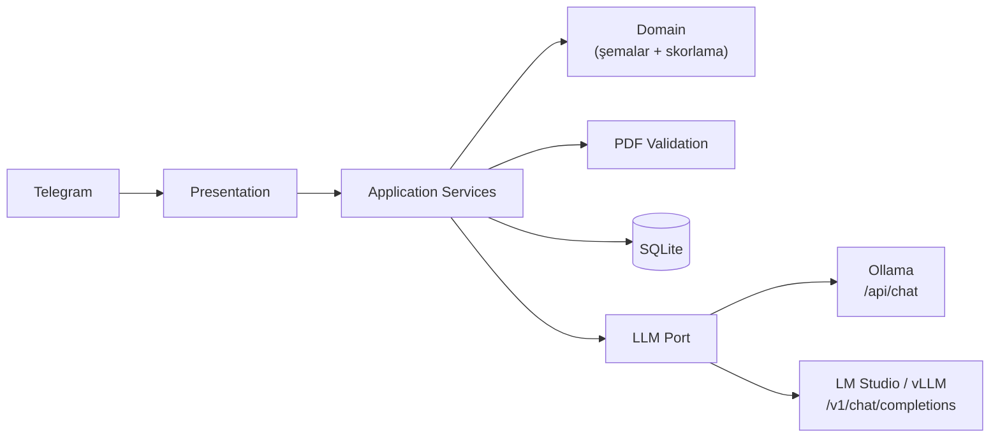

# Yapay Zeka Destekli Telegram İK ve Sohbet Botu

[](https://github.com/semihbugrasezer/sisoft-project/actions/workflows/ci.yml)


Bağlamı koruyan günlük sohbet ile LLM destekli CV değerlendirmesini tek Telegram
arayüzünde birleştiren asenkron bir bot. Kullanıcı değerlendirme kriterlerini
doğal dille tanımlar; yüklenen CV'ler doğrulanır, ortak bir `CandidateProfile`
şemasına normalize edilir ve yalnızca bu kriterlere göre değerlendirilir —
**ham PDF hiçbir zaman doğrudan skorlanmaz.**

Yerel-öncelikli çalışır: varsayılan yapılandırma `localhost`'taki Ollama'ya
bağlanır, bulut servisi veya API anahtarı gerektirmez. Referans model
**Ollama + `qwen2.5:7b`**'dir. **LM Studio** entegrasyonu da uçtan uca
doğrulanmıştır (`google/gemma-4-e4b`); **vLLM** aynı protokolü kullanır.
Çıkarım kalitesi modele bağlıdır — ölçümler:
[docs/VALIDATION.md](docs/VALIDATION.md).

## Demo

Gerçek Telegram üzerinden, gerçek yerel Ollama sunucusuna karşı çalıştırılan
5 CV'lik toplu analiz — top-3 JSON çıktısı, ödev PDF §4 şemasıyla birebir:


## Yetenekler

| Yetenek | Uygulama |
|---|---|
| Bağlamı koruyan sohbet | Sıcak pencere (40 mesaj) + rolling summary |
| Dinamik kriter tanımlama | Yapılandırılmış LLM çıkarımı, komut gerekmez |
| PDF doğrulama | Bozuk / şifreli / okunamaz / geçersiz belge reddi |
| CV normalizasyonu | LLM Extraction → `CandidateProfile`; aday adı kaynak metne karşı doğrulanır |
| Tekli CV analizi | Kriter skorları + güçlü/zayıf yönler + tavsiyeler (Markdown) |
| Çoklu CV sıralama | En fazla 5 CV → backend'de deterministik top-3 JSON |
| Kilitlenmeyen altyapı | Batch işlenirken bot yanıt vermeye devam eder |
| LLM backend'leri | Ollama, LM Studio, vLLM — tek `LLMPort` arayüzü arkasında |

## Mimari



İşlem hattı:

```
PDF → Doğrulama → Metin çıkarma → LLM Extraction → CandidateProfile JSON
                                                        ↓
                                                  Değerlendirme
                                                  ↙          ↘
                                        Markdown rapor    Backend'de
                                           (tekli)      ortalama + top-3
```

Aritmetik ortalama ve sıralama LLM'e değil backend'e aittir
(`app/domain/scoring.py`). Katman sorumlulukları, bağımlılık yönü ve hata
yayılımı: **[docs/ARCHITECTURE.md](docs/ARCHITECTURE.md)**.

## Kurulum

```bash
python3 -m venv .venv && source .venv/bin/activate
pip install -r requirements.txt
cp .env.example .env          # TELEGRAM_BOT_TOKEN ekleyin (BotFather'dan)
ollama pull qwen2.5:7b        # ilk kurulumda bir kere
python main.py                # Ollama ayakta olmalı (ollama serve)
```

Başlıca ayarlar (tamamı `.env.example` içinde açıklamalarıyla birlikte):

| Değişken | Varsayılan | Açıklama |
|---|---|---|
| `TELEGRAM_BOT_TOKEN` | — | BotFather token'ı (zorunlu) |
| `LLM_BACKEND` | `ollama` | `ollama` veya `openai_compatible` (LM Studio / vLLM) |
| `LLM_BASE_URL` | `http://localhost:11434` | LLM sunucu adresi |
| `LLM_MODEL` | `qwen2.5:7b` | Kullanılacak model |
| `CV_RETENTION_HOURS` | `24` | Analiz edilmemiş CV'lerin azami saklama süresi |

LM Studio'ya geçmek için yalnızca üç satır değişir (`LLM_BACKEND=openai_compatible`,
`LLM_BASE_URL=http://localhost:1234`, `LLM_MODEL=google/gemma-4-e4b`); kod
değişmez, application servisleri hangi motorun çalıştığını bilmez.

## Kullanım

1. `/start` — komutları listeler.
2. Kriterleri serbest metinle tanımla:
   *"CV'leri React tecrübesi, temiz kod ve uzaktan çalışma uyumuna göre değerlendir."*
3. Tek CV gönder → detaylı Markdown analiz raporu.
4. 2-5 CV'yi albüm olarak birlikte gönder → otomatik top-3 JSON.
   (Tek tek göndermek için `/batch` → PDF'ler → `/analyze`.)
5. `/criteria_show`, `/cancel`, `/reset` — yardımcı komutlar.

Çoklu CV çıktısı ödev PDF §4 şemasıyla birebirdir (`status`,
`processedCVCount`, `userDefinedCriteria`, `topCandidates[]`) ve
`extra="forbid"` ile kilitlidir.

## Test

```bash
pip install -r requirements-dev.txt
python -m pytest tests/ -q
ruff check app main.py tests scripts
mypy app main.py
```

Birim/entegrasyon testleri taklit LLM ile çalışır; ayrıca gerçek model
sunucularına karşı canlı koşular yapılmıştır. Ayrıntı:
**[docs/TESTING.md](docs/TESTING.md)** ve **[docs/VALIDATION.md](docs/VALIDATION.md)**.

## Tasarım Kararları

- **Ham PDF skorlanmaz** — önce ortak JSON şemasına normalize edilir; tüm
  puanlama bu şema üzerinden yürür (ödevin çekirdek şartı).
- **Ortalama LLM'e yaptırılmaz** — aritmetik ve sıralama backend'de
  deterministik hesaplanır.
- **Şema geçerliliği ≠ anlamsal geçerlilik** — kanıtsız yüksek puan ve kaynak
  metinde geçmeyen aday adı reddedilir.
- **Batch'te toplu LLM isteği** — tek yerel modeli N eşzamanlı istekle boğmak
  yerine iki toplu çağrı; PDF doğrulama yine paraleldir.
- **Pragmatik katmanlı mimari** — yalnızca LLM erişimi port/adapter ile
  soyutlanmıştır; tek implementasyonu olan bağımlılıklara arayüz eklenmemiştir.

Gerekçeler ve değerlendirilip reddedilen alternatifler:
**[docs/DESIGN_DECISIONS.md](docs/DESIGN_DECISIONS.md)**.

## Bilinen Sınırlamalar

- **Yerel model gecikmesi** — 5 CV'lik batch bu donanımda ~14 dakika sürer;
  darboğaz model/donanım, mimari değil.
- **OCR yok** — taranmış/görsel-yalnızca PDF'ler net bir hatayla reddedilir.
- **Metin sınırı** — çok uzun CV'ler kırpılır; kullanıcı uyarılır.
- **Demo kapsamı** — encryption-at-rest yoktur ve depolama tek instance
  varsayar; gerçek İK verisiyle üretimde kullanmadan önce [SECURITY.md](SECURITY.md).

## Dokümantasyon

| Doküman | İçerik |
|---|---|
| [Gereksinim İzlenebilirliği](docs/REQUIREMENTS_TRACEABILITY.md) | Ödev maddesi → kod → test eşlemesi |
| [Mimari](docs/ARCHITECTURE.md) | Katmanlar, eşzamanlılık, hata yayılımı, LLM backend'leri |
| [Canlı Doğrulama](docs/VALIDATION.md) | Gerçek model ve Telegram koşuları, ölçümler |
| [AI Destekli Geliştirme](docs/AI_ASSISTED_DEVELOPMENT.md) | Süreç, denetim noktaları, yakalanan hatalar |

Ayrıca: [LLM Hattı](docs/LLM_PIPELINE.md) · [Eşzamanlılık](docs/CONCURRENCY.md) ·
[Test Stratejisi](docs/TESTING.md) · [Tasarım Kararları](docs/DESIGN_DECISIONS.md) ·
[Güvenlik](SECURITY.md) · [Katkı Rehberi](CONTRIBUTING.md)
