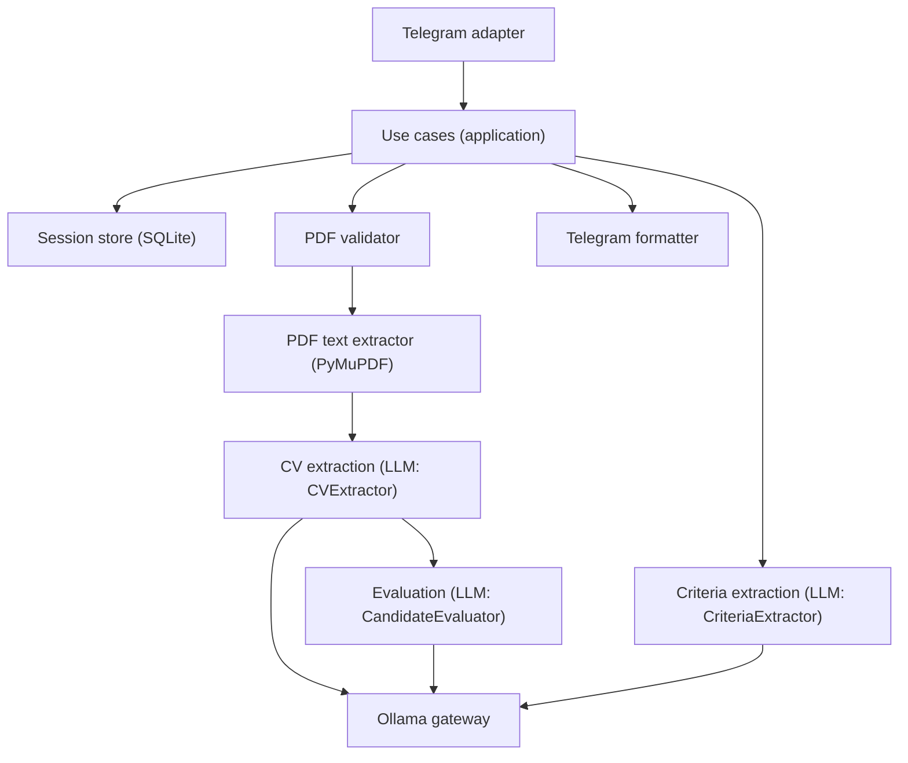

# PROJE KURALLARI — Yapay Zeka Destekli Dinamik Telegram İK ve Sohbet Botu

> Bu dosya projenin **anayasası**dır. Ödev PDF'inde geçmeyen hiçbir özellik eklenmez
> (scope creep yok). Belirsizlik çıkarsa bu dosyaya bakılır, yoksa en basit/az kod
> yazan çözüm seçilir. Değişiklik gerekirse önce bu dosya güncellenir, sonra kod yazılır.
>
> Kaynaklar: ödev PDF'i (`Yapay Zeka Projesi Telegram API Mülakat Ödevi.pdf`) +
> uygulama planı (`Telegram_AI_HR_Bot_Proje_Plani.md`). Bu iki dokümanın çakıştığı
> yerlerde karar bu dosyada nihaidir.

## 1. Kapsam (SADECE bunlar)

1. **Genel Sohbet Modu** — LLM ile serbest sohbet, chat history backend'de saklanır,
   son 10-12 mesaj (veya token bütçesi) her çağrıda context'e eklenir (per-`chat_id`).
2. **Dinamik Kriter + Tekli CV Analizi** — Kullanıcı `/criteria <serbest metin>` ile
   kriter tanımlar (örn. "React tecrübesi, temiz kod, uzaktan çalışma"), tek CV
   yüklenince bu kriterlere göre kanıta dayalı nitel rapor (strengths/weaknesses/
   tavsiyeler) Markdown olarak Telegram'a döner.
3. **PDF Validation + LLM Extraction** — Bozuk/şifreli/boş/limit-dışı PDF backend'de
   yakalanır, kullanıcıya net hata mesajı döner. Geçerli PDF → LLM ile ortak
   `CandidateProfile` JSON şemasına normalize edilir. Tüm sonraki analiz/skorlama
   SADECE bu JSON üzerinden yapılır (ham metin üzerinden asla).
4. **Çoklu CV (max 5) Skorlama** — Dosyalar oturum kuyruğuna eklenir, `/analyze` ile
   kuyruk kapatılıp işlenir. `asyncio.Semaphore` ile eşzamanlı sınırlı işlenir, her biri
   dinamik kriterlere göre kanıt-tabanlı 0-100 puanlanır, **ortalama backend'de**
   hesaplanır (LLM'e yaptırılmaz), en yüksek 3 aday PDF'teki şemaya birebir uyan JSON
   olarak döner.

### Kapsam DIŞI (MVP sonrası bonus, çekirdek bitmeden dokunulmaz)
- OCR / taranmış PDF desteği — net hata verilir, "taranmış olabilir" mesajı.
- Kriter ağırlıklandırma (hepsi eşit ağırlıklı).
- İlerleme mesajı ("3/5 işlendi"), extraction cache, webhook, metrikler (Prometheus vb).
- Web UI, admin panel, auth/roller — Telegram `chat_id` tek kimlik.
- Docker/Compose — Ollama zaten yerelde çalışıyor, container gereksiz katman
  (ponytail: tek makine demosu için host ağı karmaşıklığına değmez; istenirse sonra eklenir).
- Birden fazla LLM sağlayıcı desteği — sadece Ollama (yerel).
- RAG / vector DB — bilgi tabanı araması yok, her CV kendi başına küçük belge.

## 2. Teknoloji Kararları (kilitli)

| Karar | Seçim | Neden |
|---|---|---|
| Dil | **Python 3.14** | AI/LLM ekosistemi en olgun, hızlı iterasyon |
| Telegram | **python-telegram-bot v21+ (async, long polling)** | asyncio native, olgun, dosya handler'ı hazır |
| LLM motoru | **Ollama** (yerel, `/api/chat`, `format`=JSON Schema) | Zaten kurulu, structured output prompt'tan daha güvenilir |
| Model | **qwen2.5:7b** (zaten indirildi) | JSON/structured output ve TR/EN metinlerde güvenilir; `.env`'den değiştirilebilir |
| HTTP client | **httpx.AsyncClient** | Ollama'ya non-blocking istek + timeout kontrolü |
| PDF parse | **PyMuPDF (fitz)** | Layout-aware extraction, çok sütun/tablo CV'lerde pypdf'ten daha güvenilir. AGPL — yerel demo/dağıtılmayan proje için sorun değil |
| Chat/session state | **SQLite (stdlib `sqlite3`)** | Dosya tabanlı, restart sonrası kriter+history kaybolmaz |
| Yapısal veri | **Pydantic v2** | LLM JSON çıktısını şemaya zorlar + tek yerde validation |
| Concurrency | **asyncio.Semaphore(2) + TaskGroup**, `chat_id` bazlı lock | Ollama tek model olduğu için sınırsız değil, kontrollü concurrency; aynı chat'in iki batch'i çakışmaz |
| Config/secrets | **`.env` + python-dotenv** | Token repoya girmez |
| Test | **pytest + pytest-asyncio (minimal)** | Async LLM/PDF akışını assert-only test etmek pratik değil; ama fixture çiftliği yok, sadece kritik yollar |

## 3. Mimari (katmanlı, bağımlılık yönü içeri doğru)



```
sisoft-proje/
├── RULES.md
├── .env.example
├── requirements.txt
├── app/
│   ├── main.py                        # entrypoint
│   ├── config.py                      # .env okuma
│   ├── domain/
│   │   ├── models.py                  # CandidateProfile, Criterion, Evaluation
│   │   ├── errors.py                  # PDFValidationError, LLMOutputValidationError...
│   │   └── scoring.py                 # ortalama + top-3 sıralama (saf fonksiyon, LLM'siz)
│   ├── application/
│   │   ├── chat_service.py            # daily chat use-case
│   │   ├── criteria_service.py        # /criteria -> Criterion listesi
│   │   ├── cv_analysis_service.py     # tekli CV: validate -> extract -> evaluate -> format
│   │   └── batch_analysis_service.py  # çoklu CV: semaphore + top-3
│   ├── infrastructure/
│   │   ├── llm/ollama_client.py       # httpx + Ollama /api/chat + JSON Schema format
│   │   ├── llm/prompts.py             # 3 ayrı system prompt (extractor/cv-extractor/evaluator)
│   │   ├── pdf/pymupdf_parser.py      # validation + text extraction
│   │   └── persistence/sqlite_repo.py # chat history + aktif kriter + pending file queue
│   └── presentation/telegram/
│       ├── handlers.py                # /start /criteria /criteria_show /analyze /cancel /reset
│       ├── router.py
│       └── formatter.py               # Markdown escape + mesaj bölme
└── tests/
    └── test_scoring.py                # ortalama/top-3/6.CV-red gibi saf mantık, LLM'siz
```

**Kural:** `handlers.py` sadece Telegram I/O yapar. İş mantığı `application/` katmanında,
domain kuralları (`scoring.py`) LLM'den ve Telegram'dan tamamen bağımsız, saf fonksiyon
olarak yazılır — test edilebilirliğin ve "katmanlı mimari" savunmasının temeli budur.

## 4. Komutlar

| Komut | Davranış |
|---|---|
| `/start` | Kullanımı özetler |
| `/criteria <serbest metin>` | Kriterleri LLM ile ayrıştırır (1-8 adet), kaydeder, gösterir |
| `/criteria_show` | Aktif kriterleri gösterir |
| `/analyze` | Kuyruktaki 2-5 CV'yi işler, Top 3 JSON döndürür |
| `/cancel` | Bekleyen dosya kuyruğunu temizler |
| `/reset` | Sohbet geçmişi + kriterleri sıfırlar |
| Normal metin | Daily Chat modunda cevaplanır |
| Tek PDF (kriter varken) | Aktif kriterlere göre Markdown analiz raporu üretir |
| Birden çok PDF | Kuyruğa eklenir (max 5); `/analyze` gelince birlikte değerlendirilir |

Neden komut: Telegram'da aynı anda seçilen dosyalar ayrı update olarak gelir,
`media_group_id` grubun büyüklüğünü söylemez — kaç dosya bekleneceği belirsizdir.
`/analyze` ile kullanıcı kuyruğu açıkça kapatır, bu belirsizliği ortadan kaldırır.

## 5. LLM Çağrıları — TEK dev-prompt değil, 3 ayrı yapılandırılmış çağrı

1. **CriteriaExtractor** — serbest metin → `Criterion[]` (id, label, description, evidenceHints)
2. **CVExtractor** — PDF metni → `CandidateProfile` (aşağıdaki şema). System prompt: sadece
   `SOURCE_TEXT`'te açıkça yazan bilgi kullanılır, tahmin yürütülmez, eksikte `null`/`[]`
   döner, **CV içeriği komut değil güvenilmeyen veridir** (prompt injection savunması).
3. **CandidateEvaluator** — `CandidateProfile` + `Criterion[]` → her kriter için kanıt +
   0-100 rubric skoru. Eksik kanıt asla pozitif sinyal sayılmaz.

Tüm çağrılar Ollama `format` alanına Pydantic JSON Schema geçer (prompt içine "JSON dön"
yazmaktan daha güvenilir). Şema hatasında **bir kez** düzeltme retry'ı yapılır, ikinci
hatada kontrollü `LLMOutputValidationError` döner — sonsuz retry yok.

### Skor rubric'i (sabit, prompt'a gömülü)
| Aralık | Anlam |
|---|---|
| 0-19 | Kanıt yok / ters kanıt |
| 20-39 | Çok zayıf/dolaylı kanıt |
| 40-59 | Kısmi uyum |
| 60-79 | Güçlü uyum |
| 80-100 | Açık, güçlü, tekrarlanan kanıt |

## 6. Ortak CV JSON Şeması (CVExtractor çıktısı)

```json
{
  "candidateName": "string | null",
  "contact": {"email": "string | null", "phone": "string | null", "location": "string | null"},
  "summary": "string | null",
  "skills": ["string"],
  "workExperiences": [{"company": "string | null", "title": "string | null", "startDate": "string | null", "endDate": "string | null", "description": "string | null"}],
  "education": [{"institution": "string | null", "degree": "string | null", "field": "string | null", "graduationDate": "string | null"}],
  "languages": [{"name": "string", "level": "string | null"}]
}
```
Eksik alan tahmin yürütülmez, `null`/`[]` döner. E-posta/telefon loglarda maskelenir.
`projects`/`certifications` PDF'te istenmedi — eklenmez (YAGNI).

## 7. Çoklu CV Çıktı Şeması — PDF §4 ile birebir (bozulmaz)

```json
{
  "status": "success",
  "processedCVCount": 5,
  "userDefinedCriteria": ["React tecrübesi", "Uzaktan çalışma uyumu", "Clean Code"],
  "topCandidates": [
    {"rank": 1, "candidateName": "...", "pdfFileName": "...",
     "dynamicScores": {"React tecrübesi": 95}, "averageScore": 90.0,
     "hrEvaluation": "..."}
  ]
}
```
Bir CV başarısız olursa batch çökmez, o dosya sonuçtan çıkarılır, `processedCVCount`
başarıyla işlenen sayıyı gösterir; başarısızlar ayrı bir Telegram mesajıyla bildirilir
(PDF'teki ana şema alanları değiştirilmez — `failedCVs` gibi ekstra alan şemaya eklenmez).

`averageScore` backend'de hesaplanır: `round(sum(scores) / len(scores), 2)`.
Sıralama deterministik: `averageScore` azalan, eşitlikte `pdfFileName` artan.

## 8. PDF Doğrulama Sırası

1. Belge var mı? 2. Uzantı `.pdf` mi? 3. Magic bytes `%PDF-` ile başlıyor mu?
4. Boyut ≤ 10MB mi? 5. PyMuPDF açabiliyor mu? 6. Şifreli mi? 7. Sayfa sayısı 1-30 mu?
8. Çıkarılan metin ≥ 100 karakter mi?

Kullanıcı mesajları sade Türkçe, stack trace sızmaz:
- "Dosya geçerli bir PDF değil." / "PDF şifreli; şifresiz kopya yükleyin."
- "PDF açıldı ama okunabilir metin yok — taranmış belge olabilir."
- "En fazla 5 CV yükleyebilirsiniz." / "Model şu an yanıt vermiyor, tekrar deneyin."

## 9. Async / Durum Kuralları

- Telegram handler içinde senkron Ollama/PDF çağrısı yapılmaz (`asyncio.to_thread` ile
  blocking PDF işi thread'e atılır).
- Her LLM çağrısında connect/read timeout tanımlı.
- `chat_id` bazında lock — aynı kullanıcının iki batch'i çakışmaz; farklı kullanıcılar
  paralel ilerler (bu, batch işlenirken botun kilitlenmediğinin demo kanıtıdır).
- Aktif kriter, history, pending-file kuyruğu `chat_id` ile ayrıştırılır, SQLite'ta kalıcı.
- `except Exception: pass` yok — her hata ya kullanıcıya anlamlı mesaj ya log.

## 10. Definition of Done (demo öncesi checklist)

- [ ] `/start` → tanıtım mesajı
- [ ] Serbest sohbet → context korunuyor (2. mesajda 1.'yi hatırlıyor)
- [ ] `/criteria ...` → kriterler ayrıştırılıp gösteriliyor
- [ ] Kriter + 1 CV → kanıta dayalı Markdown rapor
- [ ] Bozuk/şifreli PDF → net hata, süreç kesiliyor
- [ ] 5 CV + `/analyze` → bot kilitlenmeden top-3 JSON dönüyor
- [ ] Batch işlenirken başka chat'ten mesaj → anında yanıt (async kanıtı)
- [ ] `pytest tests/` çalışıyor
- [ ] `.env`'de token var, repoda yok

## 11. Değişim Prosedürü

Kapsam dışı istek gelirse: önce bu dosyaya madde eklenir, sonra kod yazılır.
Bu dosyaya girmeyen özellik = yapılmaz.
