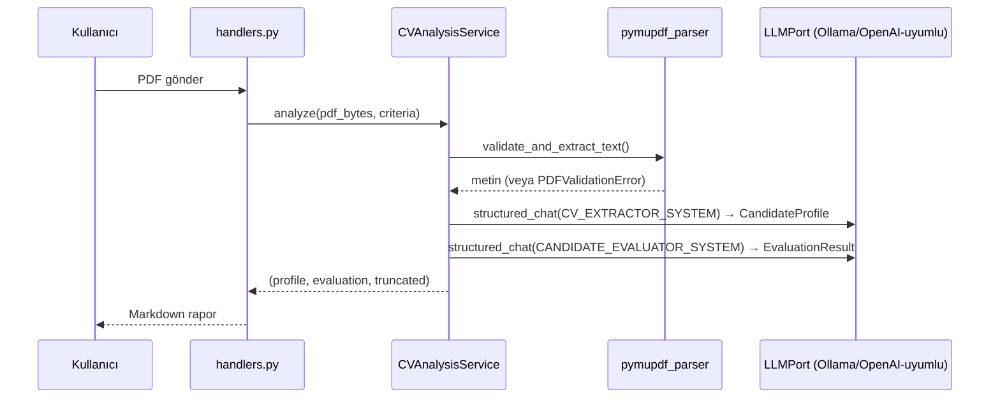

# Mimari

Katmanlı mimari, bağımlılıklar tek yönde akar. Bu doküman dosya haritasını,
katman sorumluluklarını ve istek akışını ayrıntılı anlatır — hızlı bir görsel
özet için [README.md](../README.md#mimari)'deki iki diyagrama da bakılabilir.

## Katmanlar ve Dosyalar

```
app/
├── domain/                 Framework'ten bağımsız, saf iş mantığı
│   ├── models.py           Pydantic şemaları (LLM çıktıları buraya zorlanır)
│   ├── errors.py           AppError hiyerarşisi (PDFValidationError, LLMOutputValidationError, ...)
│   ├── ports.py            LLMPort arayüzü (infrastructure bunu uygular)
│   └── scoring.py          Ortalama hesaplama, top-3 sıralama — LLM'e bağımlı değil
│
├── application/            Use-case servisleri, domain + infrastructure'ı birleştirir
│   ├── chat_service.py     Sohbet + bağlam (sıcak pencere + rolling summary)
│   ├── criteria_service.py Serbest metinden dinamik kriter çıkarımı
│   ├── cv_analysis_service.py   Tekli/batch CV: validate → extract → evaluate
│   └── batch_analysis_service.py  Çoklu CV orkestrasyonu, fail-fast validation
│
├── infrastructure/         Dış dünya adaptörleri
│   ├── llm/
│   │   ├── ollama_client.py            Ollama'nın /api/chat'i (LLMPort uygular)
│   │   ├── openai_compatible_client.py /v1/chat/completions (LM Studio/vLLM, LLMPort uygular)
│   │   └── prompts.py                  Sistem prompt'ları
│   ├── pdf/pymupdf_parser.py           PDF doğrulama + metin çıkarma
│   └── persistence/sqlite_repo.py      Sohbet geçmişi, kriter, pending-file kalıcılığı
│
└── presentation/telegram/  Telegram I/O — iş mantığı burada değil, yalnızca yönlendirme
    ├── handlers.py          Komut/mesaj handler'ları
    ├── router.py            Application kurulumu, handler kaydı
    ├── formatter.py         Markdown rapor + JSON çıktı formatlama
    └── media_group_collector.py  Albüm (çoklu dosya) toplama + debounce

container.py                 Tüm bağımlılıkları tek yerde kurar (DI, framework yok)
main.py                      Entrypoint: config → container → polling
```

## Neden Bu Ayrım

`domain` hiçbir dış bağımlılık bilmez — `scoring.py` test edilirken ne LLM'e
ne Telegram'a ihtiyaç var. LLM erişimi tam soyutlanmıştır: `application`
yalnızca `LLMPort` arayüzüne bağımlıdır, somut `OllamaClient`'a değil —
`infrastructure` bu arayüzü gerçek kütüphanelerle (httpx) uygular, testlerde
taklit (fake) bir LLM nesnesiyle değiştirilir. `SQLiteRepo` ve PDF parser'ın
ayrı bir arayüzü yoktur; `application` bunları doğrudan kullanır — Python'da
duck typing sayesinde testler yine de sahte (fake) nesnelerle izole çalışır
(bkz. `tests/test_criteria_service.py` içindeki `FakeRepo`), ayrı bir soyut
sınıf tanımlamaya gerek kalmadan. Tek implementasyon olan bir bağımlılık için
resmi bir arayüz eklemek bu projenin ölçeğinde karşılıksız bir soyutlama
olurdu (bkz. [DESIGN_DECISIONS.md](./DESIGN_DECISIONS.md)).
`presentation/telegram` yalnızca Telegram'a özgü I/O'yu bilir; iş mantığı
burada asla yoktur — bir handler her zaman bir application servisini çağırır
ve sonucu formatlar.

## İstek Akışı (Tekli CV Analizi)



Çoklu CV akışı aynı adımları izler, ancak `BatchAnalysisService` önce tüm
dosyaları paralel doğrular (`asyncio.gather`, fail-fast) ve LLM extraction/
evaluation'ı CV başına değil tüm belgeler için tek bir toplu istek olarak
çalıştırır — bkz. [DESIGN_DECISIONS.md](./DESIGN_DECISIONS.md) "Batch başına
iki LLM çağrısı".

## Eşzamanlılık

- Telegram tarafı: `Application.concurrent_updates(8)` — birden fazla sohbet
  eşzamanlı işlenebilir; `handlers.py` her `chat_id` için ayrı bir
  `asyncio.Lock` kullanır (aynı sohbette sıralı, farklı sohbetlerde paralel).
- LLM tarafı: `LLM_MAX_CONCURRENCY` (varsayılan 3) tek yerel model
  sunucusuna aynı anda giden istek sayısını sınırlayan bir semafordur —
  Telegram'ın 8 eşzamanlı update kabul etmesinden bağımsızdır.
- PDF tarafı: bloklayan `PyMuPDF` çağrıları `asyncio.to_thread` ile event
  loop dışına atılır.
