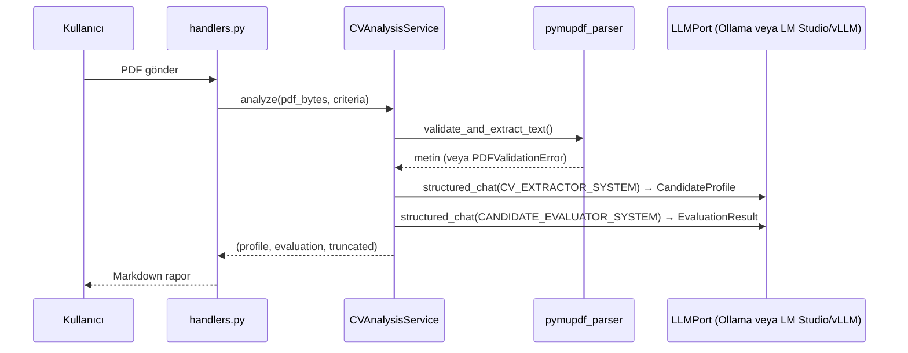

# Mimari

**Pragmatik katmanlı mimari, LLM sağlayıcıları için port soyutlamasıyla.**

Bu doküman dosya haritasını, katman sorumluluklarını, istek akışını ve hata
yayılımını anlatır.

## Gerçek Bağımlılık Yönü

Terminolojide dürüst olmak gerekirse bu tam bir "Clean Architecture" değildir:
`application` katmanı `SQLiteRepo`, PDF parser ve prompt modüllerini doğrudan
import eder. Yalnızca **LLM erişimi** tam ports-and-adapters ile soyutlanmıştır.

```
Presentation (Telegram)
      │
      ▼
Application ──────────────┐
      │                   │
      ▼                   ▼
   Domain           Infrastructure
  (saf mantık)            │
      ▲                   ├── PDF (PyMuPDF)
      │                   ├── SQLite
      │                   └── LLM adaptörleri
      │                            │
      └──── LLMPort ◄───────────────┘
           (arayüz domain'de,
            implementasyon infrastructure'da)
```

Bu bilinçli bir tercihtir: `LLMPort` gerçek bir ihtiyaca dayanır — iki farklı
implementasyon (`OllamaClient`, `OpenAICompatibleClient`) vardır ve ödev üç
farklı LLM motorunu desteklemeyi şart koşar. Buna karşılık SQLite ve PDF
parser için tek implementasyon vardır; onlara resmî bir arayüz eklemek bu
ölçekte karşılıksız bir soyutlama olurdu. Testler yine de izoledir: Python'da
duck typing sayesinde sahte (fake) nesneler ayrı bir soyut sınıf tanımlamadan
kullanılabiliyor (bkz. `tests/test_criteria_service.py::FakeRepo`).

## Katmanlar ve Dosyalar

```
app/
├── domain/                 Framework'ten bağımsız, saf iş mantığı
│   ├── models.py           Pydantic şemaları (LLM çıktıları buraya zorlanır)
│   ├── errors.py           AppError hiyerarşisi (PDFValidationError, LLMOutputValidationError, ...)
│   ├── ports.py            LLMPort arayüzü (infrastructure bunu uygular)
│   └── scoring.py          Ortalama hesaplama, top-3 sıralama — LLM'e bağımlı değil
│
├── application/            Use-case servisleri, domain + infrastructure'ı birleştirir
│   ├── chat_service.py     Sohbet + bağlam (sıcak pencere + rolling summary)
│   ├── criteria_service.py Serbest metinden dinamik kriter çıkarımı
│   ├── cv_analysis_service.py   Tekli/batch CV: validate → extract → evaluate
│   └── batch_analysis_service.py  Çoklu CV orkestrasyonu, all-or-nothing ön doğrulama
│
├── infrastructure/         Dış dünya adaptörleri
│   ├── llm/
│   │   ├── ollama_client.py            Ollama /api/chat (qwen2.5:7b)
│   │   ├── openai_compatible_client.py /v1/chat/completions — LM Studio (gemma-4-e4b), vLLM
│   │   └── prompts.py                  Sistem prompt'ları
│   ├── pdf/pymupdf_parser.py           PDF doğrulama + metin çıkarma
│   └── persistence/sqlite_repo.py      Sohbet geçmişi, kriter, pending-file kalıcılığı
│
└── presentation/telegram/  Telegram I/O — iş mantığı burada değil, yalnızca yönlendirme
    ├── handlers.py          Komut/mesaj handler'ları
    ├── router.py            Application kurulumu, handler kaydı
    ├── formatter.py         Markdown rapor + JSON çıktı formatlama
    └── media_group_collector.py  Albüm (çoklu dosya) toplama + debounce

container.py                 Tüm bağımlılıkları tek yerde kurar (DI, framework yok)
main.py                      Entrypoint: config → container → polling
```

## Katman Sorumlulukları

| Katman | Bilir | Bilmez |
|---|---|---|
| `domain` | Pydantic şemaları, saf skorlama fonksiyonları, `LLMPort` arayüzü, hata hiyerarşisi | Telegram, HTTP, veritabanı, dosya sistemi — hiçbir I/O. (Pydantic bir dış bağımlılıktır ama saf bir veri-doğrulama kütüphanesidir; `scoring.py` test edilirken ne LLM ne Telegram gerekir.) |
| `application` | Use-case orkestrasyonu, `domain` modelleri, `LLMPort` | Hangi LLM backend'inin çalıştığını (`OllamaClient` mı `OpenAICompatibleClient` mı) |
| `infrastructure` | httpx, PyMuPDF, sqlite3 — gerçek dış dünya | İş mantığını |
| `presentation/telegram` | Telegram'a özgü I/O, komut yönlendirme, formatlama | İş mantığını — handler her zaman bir application servisini çağırır ve sonucu formatlar |

`container.py` bağımlılıkları tek yerde kurar; framework kullanılmaz, basit
constructor injection yeterlidir.

## Hata Yayılımı

Tüm domain hataları tek bir kökten (`AppError`) türer ve her biri kullanıcıya
gösterilebilir bir `user_message` taşır. Bu, "sessiz yutma yok, teknik
istisna kullanıcıya sızmaz" kuralını mimari seviyede uygular.

```
Telegram Update
      │
      ▼
handlers.py  ──────────────────────────────┐
      │                                     │
      ▼                                     │
Application / Infrastructure                │
      │                                     │
      ├── PDFValidationError                │
      │     "PDF şifreli; şifresiz kopya…"  │
      ├── LLMUnavailableError               │  except AppError:
      │     "Model şu anda yanıt vermiyor…" │    reply(exc.user_message)
      ├── LLMOutputValidationError          │
      │     (tek retry sonrası)             │
      └── NoCriteriaDefinedError            │
            "Önce kriter tanımlamalısınız…" │
                                            │
      Beklenmeyen istisna ─────────────────┘
            │
            ▼
      error_handler (global)
      logger.exception(...) + genel kullanıcı mesajı
```

İki nokta özellikle önemli:

- **Batch'te all-or-nothing ön doğrulama:** bir dosya bile geçersizse hiçbir dosya LLM'e
  gönderilmez; kısmi sonuç yerine net bir hata döner.
- **Garantili temizlik:** `/analyze` beklenmeyen bir istisna alsa bile
  bekleyen CV verisi `try/finally` ile silinir (bkz. [SECURITY.md](../SECURITY.md)).

## İstek Akışı (Tekli CV Analizi)



Çoklu CV akışı aynı adımları izler, ancak `BatchAnalysisService` önce tüm
dosyaları paralel doğrular (`asyncio.gather`; ilk hatada kesmez — hepsi
biter, sonra tamamı reddedilir) ve LLM extraction/
evaluation'ı CV başına değil tüm belgeler için tek bir toplu istek olarak
çalıştırır — bkz. [DESIGN_DECISIONS.md](./DESIGN_DECISIONS.md) "Batch başına
iki LLM çağrısı".

## LLM Backend'leri

Ödev üç motoru da destekler; ikisi tek adaptörle karşılanır:

| Motor | Adaptör | Uç | Durum |
|---|---|---|---|
| Ollama | `OllamaClient` | `/api/chat` (Ollama'ya özgü) | `qwen2.5:7b` ile canlı doğrulandı |
| LM Studio | `OpenAICompatibleClient` | `/v1/chat/completions` | `google/gemma-4-e4b` ile canlı doğrulandı |
| vLLM | `OpenAICompatibleClient` | `/v1/chat/completions` | Aynı protokol; donanım kısıtı nedeniyle canlı test edilmedi |

**"OpenAI-uyumlu" bir protokol adıdır, servis adı değil.** HTTP biçimini
OpenAI'ın API'si popülerleştirdiği için bu adla anılır; LM Studio ve vLLM kendi
sunucularını bu biçimde sunar. Proje OpenAI servisine bağlanmaz — `openai`
paketi bağımlılık değildir ve istekler `LLM_BASE_URL`'in gösterdiği sunucuya
(varsayılan: `localhost`) gider. Tek adaptörün iki motoru birden karşılamasının
nedeni ikisinin de aynı protokolü paylaşmasıdır; ayrı `LMStudioClient` ve
`VLLMClient` yazmak aynı kodu iki kez yazmak olurdu.

Uzak bir uç yapılandırılırsa CV içeriği o sunucuya gönderilir — bkz.
[SECURITY.md](../SECURITY.md).

## Eşzamanlılık

Dört ayrı katman (Telegram update kabulü, sohbet başına kilit, bloklayan PDF
işi, LLM istek limiti) ayrı bir dokümanda ayrıntılı anlatılıyor:
**[CONCURRENCY.md](./CONCURRENCY.md)**.

Özet:

- `Application.concurrent_updates(8)` — birden fazla sohbet eşzamanlı işlenir.
- `chat_id` bazlı `asyncio.Lock` — aynı sohbette sıralı, farklı sohbetlerde paralel.
- `asyncio.to_thread` — bloklayan PyMuPDF/sqlite3 çağrıları event loop dışında.
- `asyncio.Semaphore(LLM_MAX_CONCURRENCY)` — tek model sunucusuna giden istek limiti.

## Bilinen Mimari Kısıtlar

- **Tek instance varsayımı** — SQLite ve bellek içi kilitler/albüm tamponu tek
  process varsayar; yatay ölçekleme için paylaşılan bir state store gerekir.
- **Batch LLM aşaması CV başına paralel değil** — bilinçli tercih, gerekçesi
  [DESIGN_DECISIONS.md](./DESIGN_DECISIONS.md) ve [CONCURRENCY.md](./CONCURRENCY.md)'de.
- **20.000 karakter extraction sınırı** — çok uzun CV'ler kırpılır; kullanıcı
  uyarılır.
- **Encryption-at-rest yok** — bkz. [SECURITY.md](../SECURITY.md). Bekleyen CV'ler
  için `CV_RETENTION_HOURS` ile açılışta TTL temizliği yapılır; sohbet geçmişi
  için TTL yoktur.
