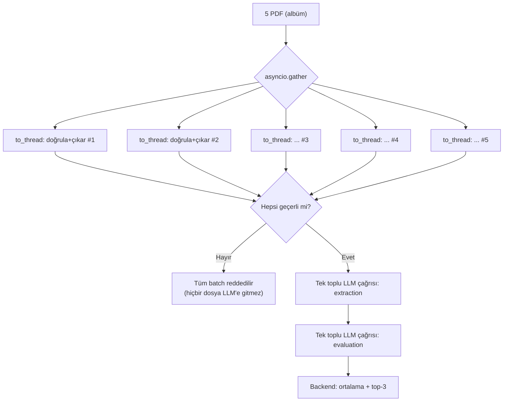

# Eşzamanlılık Modeli

Ödev, Telegram akışının kilitlenmemesini ve çoklu dosya işlenirken botun yanıt
vermeye devam etmesini açıkça şart koşuyor. Bu doküman dört ayrı eşzamanlılık
katmanını ve her birinin neden farklı bir mekanizma kullandığını anlatır.

## Dört Katman

```
1. Telegram update kabulü
   Application.concurrent_updates(8)
   → aynı anda 8 update işlenebilir; biri LLM beklerken diğerleri akar

2. Sohbet başına sıralama
   chat_id → asyncio.Lock
   → AYNI sohbette işler sıralı (yarış koşulu yok)
   → FARKLI sohbetler birbirini beklemez

3. Bloklayan PDF işi
   asyncio.to_thread(validate_and_extract_text, ...)
   → senkron PyMuPDF event loop'u bloklamaz
   → batch'te asyncio.gather ile N dosya paralel doğrulanır

4. LLM istek sayısı
   asyncio.Semaphore(LLM_MAX_CONCURRENCY)  # varsayılan 3
   → tek yerel model sunucusuna aynı anda giden istek sınırlanır
```

Her katman farklı bir problemi çözer; biri diğerinin yerine geçmez.

## Neden chat_id Bazlı Kilit (Global Kilit Değil)

`concurrent_updates(8)` aynı sohbetten gelen iki mesajın da eşzamanlı
işlenmesine izin verir. Bu, sohbet geçmişi ve bekleyen CV kuyruğu gibi
paylaşılan durumda yarış koşulu yaratır.

Global tek bir kilit bunu çözerdi ama botu tümüyle seri hale getirirdi —
ödevin "batch işlenirken bot yanıt vermeye devam etmeli" şartını bozardı.
Bunun yerine `handlers.py` her `chat_id` için ayrı bir `asyncio.Lock` tutar:

```python
lock = _chat_lock(context, chat_id)
async with lock:
    ...  # bu sohbetin işleri sıralı
```

Sonuç: A sohbeti 10 dakikalık bir batch analizi çalıştırırken B sohbeti
normal hızda yanıt alır. Bu, gerçek Telegram üzerinde canlı doğrulandı
(bkz. [VALIDATION.md](./VALIDATION.md)).

Aynı yarış koşulu veritabanı seviyesinde de düşünüldü:
`try_add_pending_file` sayma ve ekleme işlemini **tek atomik SQL çağrısında**
yapar — ayrı `count` + `insert` çağrıları, eşzamanlı iki dosyanın 5 CV
limitini birlikte aşmasına izin verirdi (TOCTOU).

## Neden asyncio (Thread Pool "Yerine" Değil, Onunla Birlikte)

İş yükünün büyük kısmı I/O-bound'dur:

| İş | Tür | Mekanizma |
|---|---|---|
| Telegram API çağrıları | ağ I/O | `asyncio` (python-telegram-bot) |
| LLM HTTP çağrıları | ağ I/O | `asyncio` (`httpx.AsyncClient`) |
| SQLite okuma/yazma | disk I/O, senkron API | `asyncio.to_thread` |
| PDF parse (PyMuPDF) | CPU + senkron API | `asyncio.to_thread` |

PyMuPDF ve `sqlite3` senkron kütüphanelerdir; doğrudan çağrılırsa event
loop'u bloklarlar. `asyncio.to_thread` bunları arka plandaki bir thread
pool'a taşır — yani "thread pool yerine asyncio" değil, **her ikisi de,
doğru katmanda**.

## Batch Akışında Eşzamanlılık



**Doğrulama aşaması paraleldir** (`asyncio.gather`, 5 dosya aynı anda).
**LLM aşaması toplu tek istektir** — CV başına ayrı istek değil.

Bu bilinçli bir karardır: tek bir yerel Ollama instance'ı istekleri GPU'da
zaten seri işler, dolayısıyla 5 eşzamanlı istek gerçek paralellik getirmez;
buna karşılık her istekte sistem prompt'u tekrarlandığı için toplam token
maliyetini ve timeout riskini artırır. Daha önceki on-çağrılı tasarım timeout
sorunları yaşadığı için terk edilmişti. Ayrıntı ve ölçümler:
[DESIGN_DECISIONS.md](./DESIGN_DECISIONS.md), [VALIDATION.md](./VALIDATION.md).

Ölçülen süre (5 CV, `qwen2.5:7b`, Apple Silicon): ~852s (259.6s extraction +
592.4s evaluation). Darboğaz mimari değil, yerel modelin kısıtlı-JSON üretim
hızıdır. GPU destekli bir vLLM/OpenAI-uyumlu uca geçiş yalnızca konfigürasyon
değişikliğidir (`LLM_BACKEND=openai_compatible`).

## LLM Semaforu Neden Gerekli

Telegram 8 update'i eşzamanlı kabul ederken tek model sunucusu bunları paralel
işleyemez. Sınırsız istek göndermek yanıt verme garantisini bozmaz ama
gecikmeyi öngörülemez şekilde büyütür ve timeout riskini artırır.
`LLM_MAX_CONCURRENCY` (varsayılan 3) kaç isteğin aynı anda "uçuşta"
olabileceğini backend'de sınırlar:

```python
async with self._semaphore:
    resp = await self._client.post(f"{self._base_url}/api/chat", json=payload)
```

Bu limit hem `OllamaClient` hem `OpenAICompatibleClient` içinde uygulanır.

## Albüm (Media Group) Toplama

Telegram'da aynı anda seçilip gönderilen dosyalar tek bir mesaj olarak değil,
**ayrı update'ler** olarak gelir ve kaç tane geleceği önceden bilinmez.
`media_group_collector.py` aynı `media_group_id`'ye sahip dosyaları toplar ve
kısa bir debounce (1.8 sn) sonrasında işlemeyi tetikler — son dosya geldikten
sonra kısa bir sessizlik, grubun tamamlandığı anlamına gelir. Limit dolduğunda
(5 dosya) beklemeden hemen tetiklenir.

Bu, `asyncio` task'ı olarak çalışır (`context.application.create_task`), yani
toplama süreci de Telegram akışını bloklamaz.

## Zaman Aşımı

`LLM_TIMEOUT` (varsayılan 1200s) tek bir LLM isteğinin üst sınırıdır. Canlı
testte 600s'lik önceki varsayılan, 5 CV'lik batch evaluation adımını yarıda
kesmişti (`LLMUnavailableError` — kontrollü hata mesajı döndü, çökme olmadı).
Yerel 7B modellerde batch analizi 10+ dakika sürebildiği için varsayılan
yükseltildi.
