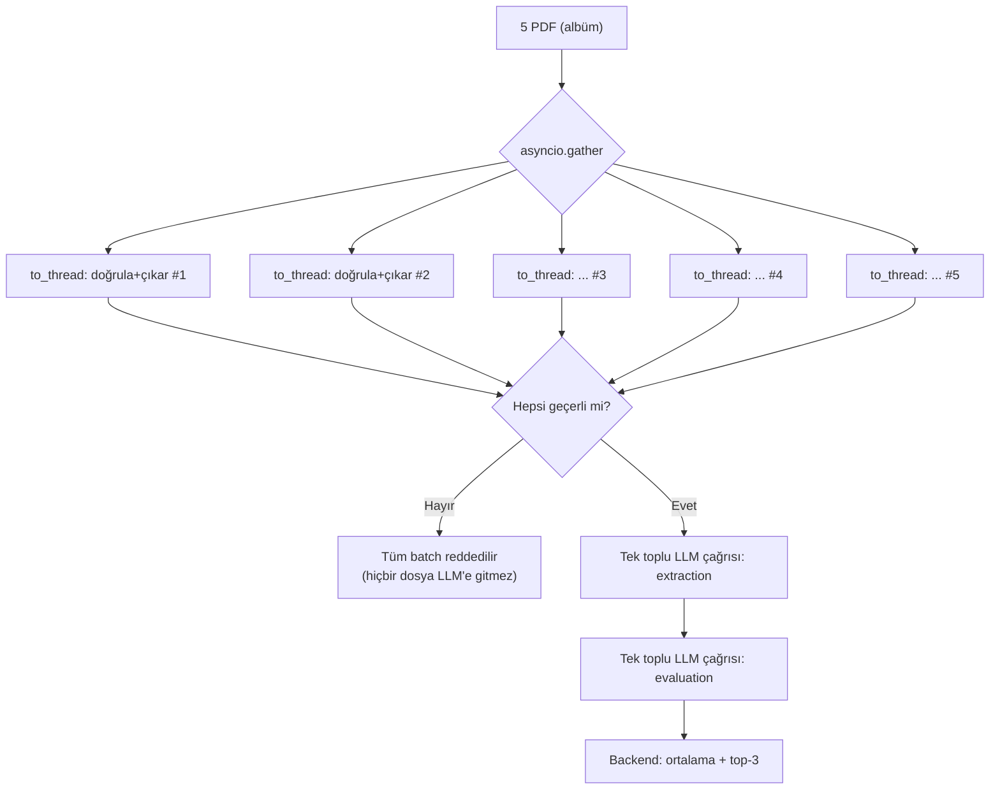

# Eşzamanlılık Modeli

Ödev, Telegram akışının kilitlenmemesini ve çoklu dosya işlenirken botun yanıt
vermeye devam etmesini açıkça şart koşuyor. Bu doküman dört ayrı eşzamanlılık
katmanını ve her birinin neden farklı bir mekanizma kullandığını anlatır.

## Dört Katman

```
1. Telegram update kabulü
   Application.concurrent_updates(8)
   → aynı anda 8 update işlenebilir; biri LLM beklerken diğerleri akar

2. Sohbet başına sıralama — İKİ AYRI lock ailesi
   chat_locks_text[chat_id]      → kriter yazımı + sohbet + /reset
   chat_locks_analysis[chat_id]  → CV analizi (tekli ve batch)
   → AYNI sohbette her aile kendi içinde sıralı
   → FARKLI sohbetler birbirini beklemez
   → İki aile birbirini de beklemez: batch analizi sürerken
     aynı sohbetten sohbet etmek mümkün kalır

3. Bloklayan PDF işi
   asyncio.to_thread(validate_and_extract_text, ...)
   → senkron PyMuPDF event loop'u bloklamaz
   → batch'te asyncio.gather ile N dosya paralel doğrulanır

4. LLM istek sayısı
   asyncio.Semaphore(LLM_MAX_CONCURRENCY)  # varsayılan 3
   → tek yerel model sunucusuna aynı anda giden istek sınırlanır
```

Her katman farklı bir problemi çözer; biri diğerinin yerine geçmez.

Context7 üzerinden kontrol edilen resmi `python-telegram-bot` v22.5
[`ApplicationBuilder` dokümantasyonu](https://docs.python-telegram-bot.org/en/v22.5/telegram.ext.applicationbuilder.html), update işlemenin varsayılan olarak sıralı
olduğunu ve `concurrent_updates(...)` ile açıkça eşzamanlı hale getirildiğini
doğrular. Aynı lifecycle API'sindeki async `post_shutdown` callback'i de LLM ve
SQLite bağlantılarını await ederek kapatmak için kullanılır. Bu yüzden sekizli
update kabulü ile sohbet-başına kilitler birbirinin alternatifi değil,
tamamlayıcısıdır.

## Neden chat_id Bazlı Kilit (Global Kilit Değil)

`concurrent_updates(8)` aynı sohbetten gelen iki mesajın da eşzamanlı
işlenmesine izin verir. Bu, sohbet geçmişi ve bekleyen CV kuyruğu gibi
paylaşılan durumda yarış koşulu yaratır.

Global tek bir kilit bunu çözerdi ama botu tümüyle seri hale getirirdi —
ödevin "batch işlenirken bot yanıt vermeye devam etmeli" şartını bozardı.
Bunun yerine `handlers.py` `chat_id` başına **iki ayrı** lock ailesi tutar:

```python
# Metin durumu: kriter yazımı + sohbet + reset tek kritik bölümde
async with _chat_lock(context, chat_id, "text"):
    criteria = await criteria_service.define_if_requested(chat_id, text)
    ...
    reply = await chat_service.reply(chat_id, text)

# CV analizi: ayrı aile — sohbeti bloklamaz
async with _chat_lock(context, chat_id, "analysis"):
    ...
```

Niyet sınıflandırmasının da kilit içinde olması önemlidir: bu bir LLM
çağrısıdır (saniyeler sürer) ve kilit dışında bırakılırsa aynı sohbetten
hızlıca gelen iki mesajın sınıflandırması paralel başlar; ikincisi önce
bitip `ChatService.reply()`'a önce girebilir ve sohbet geçmişi Telegram'daki
geliş sırasından farklı bir sırayla yazılır. Bu davranış bir regresyon
testiyle korunuyor: `test_same_chat_messages_are_processed_in_arrival_order`.

`/criteria`, PDF caption'ından kriter tanımlama ve `/reset` de aynı `text`
kilidini kullanır. Böylece reset sürmekte olan kriter çıkarımını bekler ve eski
kriterler reset tamamlandıktan sonra yeniden yazılamaz. Bu iki giriş yolu
`test_reset_waits_for_in_flight_criteria_command_before_clearing` ve
`test_reset_waits_for_in_flight_caption_criteria_before_clearing` ile korunur.

İki ailenin ayrı tutulması da kasıtlıdır: tek lock olsaydı 17 dakikaya varan bir
batch analizi boyunca aynı sohbetten mesaj atmak imkânsız olurdu.

Sonuç: A sohbeti uzun bir batch analizi çalıştırırken hem B sohbeti hem de
A'nın kendi sohbet mesajları normal hızda yanıt alır. Bu, gerçek Telegram
üzerinde canlı doğrulandı (bkz. [VALIDATION.md](./VALIDATION.md)).

Aynı yarış koşulu veritabanı seviyesinde de düşünüldü:
`try_add_pending_file` içindeki `SELECT COUNT` + `INSERT` çifti repo'nun
`asyncio.Lock`'u altında **tek kritik bölüm** olarak çalışır — iki ayrı
`count_pending_files()` + `add_pending_file()` çağrısı, eşzamanlı iki
dosyanın aynı sayıyı okuyup 5 CV limitini birlikte aşmasına izin verirdi
(TOCTOU). Atomiklik tek bir SQL statement'tan değil, bu lock'tan gelir.

`/analyze` da `take_pending_files` ile snapshot'ı aynı lock altında okuyup
kuyruktan çıkarır. Böylece eşzamanlı iki `/analyze` aynı CV'leri iki kez
işleyemez; analiz başladıktan sonra yüklenen yeni dosyalar sonraki kuyrukta
kalır ve eski analizin temizliğinde silinmez.

## Neden asyncio (Thread Pool "Yerine" Değil, Onunla Birlikte)

İş yükünün büyük kısmı I/O-bound'dur:

| İş | Tür | Mekanizma |
|---|---|---|
| Telegram API çağrıları | ağ I/O | `asyncio` (python-telegram-bot) |
| LLM HTTP çağrıları | ağ I/O | `asyncio` (`httpx.AsyncClient`) |
| SQLite okuma/yazma | disk I/O, senkron API | `asyncio.to_thread` |
| PDF parse (PyMuPDF) | CPU + senkron API | `asyncio.to_thread` |

PyMuPDF ve `sqlite3` senkron kütüphanelerdir; doğrudan çağrılırsa event
loop'u bloklarlar. `asyncio.to_thread` bunları arka plandaki bir thread
pool'a taşır — yani "thread pool yerine asyncio" değil, **her ikisi de,
doğru katmanda**.

## Batch Akışında Eşzamanlılık



**Doğrulama aşaması paraleldir** (`asyncio.gather`, 5 dosya aynı anda).
**LLM aşaması toplu tek istektir** — CV başına ayrı istek değil.

Bu bilinçli bir karardır: tek bir yerel Ollama instance'ı istekleri GPU'da
zaten seri işler, dolayısıyla 5 eşzamanlı istek gerçek paralellik getirmez;
buna karşılık her istekte sistem prompt'u tekrarlandığı için toplam token
maliyetini ve timeout riskini artırır. Daha önceki on-çağrılı tasarım timeout
sorunları yaşadığı için terk edilmişti. Ayrıntı ve ölçümler:
[DESIGN_DECISIONS.md](./DESIGN_DECISIONS.md), [VALIDATION.md](./VALIDATION.md).

Ölçülen süre (5 CV, `qwen2.5:7b`, Apple Silicon): 463.5–1003.8s (~8–17 dk).
Darboğaz mimari değil, yerel modelin kısıtlı-JSON üretim hızıdır. GPU destekli
bir vLLM/OpenAI-uyumlu uca geçiş yalnızca konfigürasyon değişikliğidir
(`LLM_BACKEND=openai_compatible`).

## LLM Semaforu Neden Gerekli

Telegram 8 update'i eşzamanlı kabul ederken tek model sunucusu bunları paralel
işleyemez. Sınırsız istek göndermek yanıt verme garantisini bozmaz ama
gecikmeyi öngörülemez şekilde büyütür ve timeout riskini artırır.
`LLM_MAX_CONCURRENCY` (varsayılan 3) kaç isteğin aynı anda "uçuşta"
olabileceğini backend'de sınırlar:

```python
async with self._semaphore:
    resp = await self._client.post(f"{self._base_url}/api/chat", json=payload)
```

Bu limit hem `OllamaClient` hem `OpenAICompatibleClient` içinde uygulanır.

## Albüm (Media Group) Toplama

Telegram'da aynı anda seçilip gönderilen dosyalar tek bir mesaj olarak değil,
**ayrı update'ler** olarak gelir ve kaç tane geleceği önceden bilinmez.
`media_group_collector.py` aynı `media_group_id`'ye sahip dosyaları toplar ve
kısa bir debounce (1.8 sn) sonrasında işlemeyi tetikler — son dosya geldikten
sonra kısa bir sessizlik, grubun tamamlandığı anlamına gelir. Limit dolduğunda
(5 dosya) beklemeden hemen tetiklenir.

Bu, `asyncio` task'ı olarak çalışır (`context.application.create_task`), yani
toplama süreci de Telegram akışını bloklamaz.

Grup işlendikten sonra **kapatılır** (`pop` grubu sınırlı kapasiteli bir
"kapalı gruplar" kaydına ekler). Aksi halde Telegram'dan geç gelen bir update —
örneğin limit dolduğu için hemen işlenen 5 dosyalık albümün 6. dosyası — sözlükte
artık bulunmayan grup için `setdefault` ile yeni bir arabellek yaratır ve ayrı bir
batch gibi işlenirdi. Regresyon testi:
`test_late_file_after_group_is_processed_is_rejected`.

## Zaman Aşımı

`LLM_TIMEOUT` (varsayılan 1200s) tek bir LLM isteğinin üst sınırıdır. Canlı
testte 600s'lik önceki varsayılan, 5 CV'lik batch evaluation adımını yarıda
kesmişti (`LLMUnavailableError` — kontrollü hata mesajı döndü, çökme olmadı).
Yerel 7B modellerde batch analizi 10+ dakika sürebildiği için varsayılan
yükseltildi.
